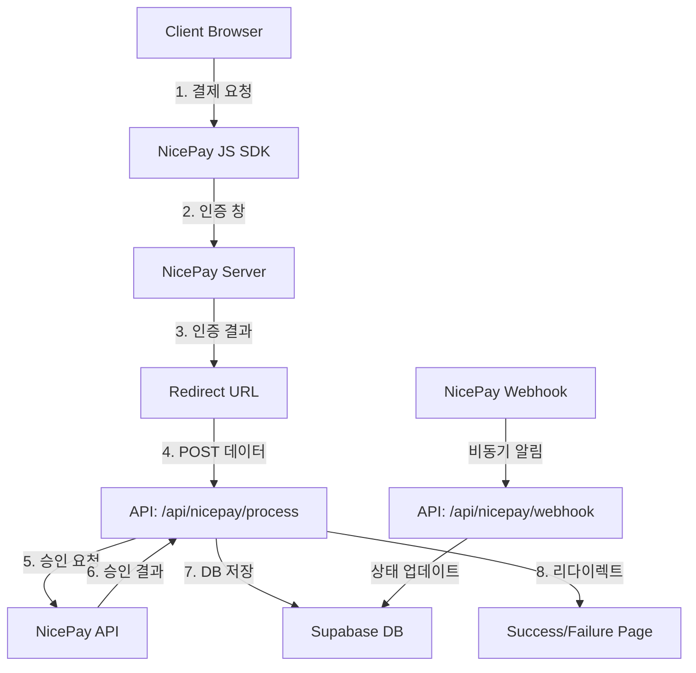

# NicePay 결제 시스템 구현 가이드

## 📋 목차
1. [개요](#개요)
2. [시스템 아키텍처](#시스템-아키텍처)
3. [환경 설정](#환경-설정)
4. [파일 구조](#파일-구조)
5. [핵심 구현 모듈](#핵심-구현-모듈)
6. [결제 플로우](#결제-플로우)
7. [데이터베이스 스키마](#데이터베이스-스키마)
8. [보안 고려사항](#보안-고려사항)
9. [테스트 및 디버깅](#테스트-및-디버깅)
10. [체크리스트](#체크리스트)

---

## 개요

이 프로젝트는 **NicePay Server 승인 방식**을 사용하여 결제 시스템을 구현합니다. 
- **결제 서비스**: NicePay (https://api.nicepay.co.kr)
- **결제 방식**: Server Authorization Method
- **지원 결제수단**: 카드, 계좌이체, 네이버페이, 카카오페이

### 주요 특징
- 서버 승인 방식으로 보안 강화
- 결제 실패 시 자동 복구 메커니즘
- 웹훅을 통한 실시간 결제 상태 동기화
- TypeScript 기반 타입 세이프티

---

## 시스템 아키텍처



---

## 환경 설정

### 필수 환경 변수 (.env.local)

```bash
# NicePay Configuration
NICEPAY_CLIENT_ID=R2_xxxxxxxxxxxxxxxxxxxxx  # NicePay 제공 클라이언트 ID
NICEPAY_SECRET_KEY=xxxxxxxxxxxxxxxxxxxxxxxxx  # NicePay 제공 시크릿 키 (서버 승인용 Access Token)
NICEPAY_API_URL=https://api.nicepay.co.kr    # Production API URL

# Site Configuration  
NEXT_PUBLIC_SITE_URL=https://yourdomain.com  # 프로덕션 도메인

# Database (Supabase)
NEXT_PUBLIC_SUPABASE_URL=https://xxx.supabase.co
NEXT_PUBLIC_SUPABASE_ANON_KEY=eyJhbGci...

NODE_ENV=production  # or development
```

### NicePay 계정 설정

1. NicePay 가맹점 관리자 페이지 접속
2. API 인증 정보 확인 (Client ID, Access Token)
3. 웹훅 URL 설정: `https://yourdomain.com/api/nicepay/webhook`
4. Return URL 설정: `https://yourdomain.com/api/nicepay/process`

---

## 파일 구조

```
project-root/
├── lib/
│   ├── payments/
│   │   └── nicepay.ts              # NicePay 핵심 유틸리티 함수
│   ├── types/
│   │   └── nicepay.ts              # NicePay 타입 정의
│   └── hooks/
│       └── useNicePayConfig.ts     # NicePay 설정 훅
│
├── app/
│   ├── api/
│   │   └── nicepay/
│   │       ├── config/route.ts     # 클라이언트 설정 API
│   │       ├── process/route.ts    # 결제 승인 처리 API
│   │       ├── cancel/route.ts     # 결제 취소 API
│   │       └── webhook/route.ts    # 웹훅 처리 API
│   │
│   ├── payments/
│   │   ├── success/page.tsx        # 결제 성공 페이지
│   │   ├── failure/page.tsx        # 결제 실패 페이지
│   │   └── error/page.tsx          # 결제 오류 페이지
│   │
│   └── (main)/
│       └── programs/
│           └── [slug]/
│               └── book/page.tsx    # 결제 시작 페이지
│
└── types/
    └── database.ts                  # Supabase 데이터베이스 타입
```

---

## 핵심 구현 모듈

### 1. NicePay 유틸리티 함수 (`lib/payments/nicepay.ts`)

#### 주요 함수 목록

```typescript
// 인증 헤더 생성 (Basic Auth)
function generateAuthHeader(): string {
  const credentials = `${CLIENT_ID}:${ACCESS_TOKEN}`;
  return `Basic ${Buffer.from(credentials).toString('base64')}`;
}

// 주문 ID 생성
export function generateOrderId(userId: string, programId: string): string {
  const timestamp = Date.now();
  return `ORDER_${timestamp}_${userId.slice(0, 8)}_${programId.slice(0, 8)}`;
}

// 결제 승인 처리
export async function processPaymentApproval(
  tid: string, 
  amount: number
): Promise<{
  success: boolean;
  data?: NicePayApprovalResponse;
  error?: string;
}>

// 결제 취소
export async function cancelPayment(
  tid: string,
  amount: number,
  reason: string,
  orderId: string
): Promise<{
  success: boolean;
  data?: any;
  error?: string;
}>

// 결제 상태 조회
export async function getPaymentStatus(tid: string): Promise<{
  success: boolean;
  data?: any;
  error?: string;
}>
```

#### API 엔드포인트

```typescript
// Production
const API_BASE_URL = 'https://api.nicepay.co.kr/v1/payments'

// SDK URL
const NICEPAY_JS_SDK_URL = 'https://pay.nicepay.co.kr/v1/js/'
```

### 2. 타입 정의 (`lib/types/nicepay.ts`)

```typescript
// 결제 요청 타입
export interface NicePayPaymentRequest {
  orderId: string
  amount: number
  goodsName: string
  customerName: string
  customerEmail: string
  customerMobilePhone?: string
  returnUrl: string
  cancelUrl?: string
  mallReserved?: string  // 추가 데이터 (JSON 문자열)
}

// 인증 결과 타입
export interface NicePayAuthResult {
  authResultCode: string  // '0000'이면 성공
  authResultMsg: string
  tid: string             // 거래 ID
  clientId: string
  orderId: string
  amount: string
  mallReserved: string
  authToken: string
  signature: string
}

// 승인 응답 타입
export interface NicePayApprovalResponse {
  resultCode: string      // '0000'이면 성공
  resultMsg: string
  tid: string
  orderId: string
  amount: number
  payMethod: string
  paidAt: string
  status: string
  // ... 카드 정보, 영수증 URL 등
}
```

### 3. API 라우트 구현

#### 설정 API (`app/api/nicepay/config/route.ts`)

```typescript
export async function GET(request: NextRequest) {
  try {
    const config = {
      clientId: getNicePayClientId(),
      jsSDKUrl: getNicePayJsSDKUrl(),
      environment: process.env.NODE_ENV === 'production' ? 'production' : 'sandbox'
    }
    
    return NextResponse.json({
      success: true,
      data: config
    })
  } catch (error) {
    return NextResponse.json({
      success: false,
      error: error.message
    }, { status: 500 })
  }
}
```

#### 결제 승인 처리 (`app/api/nicepay/process/route.ts`)

```typescript
export async function POST(request: NextRequest) {
  // 1. NicePay로부터 POST 데이터 수신
  const formData = await request.formData()
  const authResult: NicePayAuthResult = {
    authResultCode: formData.get('authResultCode') as string,
    tid: formData.get('tid') as string,
    orderId: formData.get('orderId') as string,
    amount: formData.get('amount') as string,
    mallReserved: formData.get('mallReserved') as string,
    // ...
  }
  
  // 2. 인증 결과 확인
  if (authResult.authResultCode !== '0000') {
    return NextResponse.redirect(new URL('/payments/failure', request.url))
  }
  
  // 3. 결제 승인 요청
  const approvalResult = await processPaymentApproval(
    authResult.tid, 
    parseInt(authResult.amount)
  )
  
  // 4. 데이터베이스 저장
  if (approvalResult.success) {
    
    // payment 기록 생성
    await supabase.from('payments').insert({
      order_id: authResult.orderId,
      payment_key: authResult.tid,
      amount: amount,
      status: 'completed',
      // ...
    })
    
    return NextResponse.redirect(new URL('/payments/success', request.url))
  }
  
  return NextResponse.redirect(new URL('/payments/failure', request.url))
}
```

### 4. 클라이언트 구현

#### NicePay 설정 훅 (`lib/hooks/useNicePayConfig.ts`)

```typescript
export function useNicePayConfig() {
  const [config, setConfig] = useState<NicePayConfig | null>(null)
  const [loading, setLoading] = useState(true)
  const [error, setError] = useState<string | null>(null)

  useEffect(() => {
    async function fetchConfig() {
      const response = await fetch('/api/nicepay/config')
      const result = await response.json()
      
      if (result.success) {
        setConfig(result.data)
      } else {
        setError(result.error)
      }
    }
    
    fetchConfig()
  }, [])

  return { config, loading, error }
}
```

#### 결제 시작 페이지 (`app/(main)/programs/[slug]/book/page.tsx`)

```typescript
export default function ProgramBookingPage() {
  const { config: nicePayConfig } = useNicePayConfig()
  const [sdkLoaded, setSdkLoaded] = useState(false)
  
  const handlePayment = async () => {
    if (!window.AUTHNICE || !nicePayConfig) return
    
    const orderId = generateOrderId(user.id, program.id)
    
    // NicePay 결제창 호출
    window.AUTHNICE.requestPay({
      clientId: nicePayConfig.clientId,
      method: selectedPaymentMethod,  // 'card', 'bank', 'naverpayCard', 'kakaopay'
      orderId: orderId,
      amount: amount,
      goodsName: program.title,
      buyerName: form.participantName,
      buyerEmail: form.participantEmail,
      buyerPhone: form.participantPhone,
      returnUrl: `${window.location.origin}/api/nicepay/process`,
      mallReserved: JSON.stringify({
        program_id: program.id,
        user_id: user.id,
        participant_name: form.participantName,
        // ... 추가 데이터
      }),
      fnError: function(result) {
        console.error('결제 오류:', result)
        setError(result.errorMsg)
      }
    })
  }
  
  return (
    <>
      {/* 결제 UI */}
      
      {/* NicePay SDK 로드 */}
      {nicePayConfig && (
        <Script
          src={nicePayConfig.jsSDKUrl}
          onLoad={() => setSdkLoaded(true)}
          onError={(e) => setError('결제 시스템 로드 실패')}
        />
      )}
    </>
  )
}
```

---

## 결제 플로우

### 1. 결제 시작 플로우

```
1. 사용자가 결제 버튼 클릭
2. 클라이언트에서 /api/nicepay/config 호출하여 설정 로드
3. NicePay JS SDK 로드
4. AUTHNICE.requestPay() 호출
5. NicePay 결제창 표시
```

### 2. 결제 인증 플로우

```
1. 사용자가 결제 정보 입력 (카드번호, 비밀번호 등)
2. NicePay 서버에서 인증 처리
3. 인증 성공 시 returnUrl로 POST 리다이렉트
4. /api/nicepay/process에서 POST 데이터 수신
```

### 3. 결제 승인 플로우

```
1. authResultCode 확인 ('0000'이면 성공)
2. processPaymentApproval() 호출하여 서버 승인
3. NicePay API에 POST /v1/payments/{tid} 요청
4. 승인 성공 시 데이터베이스에 저장
5. 성공/실패 페이지로 리다이렉트
```

### 4. 결제 취소 플로우

```
1. 사용자가 취소 요청
2. /api/nicepay/cancel 호출
3. cancelPayment() 함수로 NicePay API 호출
4. POST /v1/payments/{tid}/cancel 요청
5. 데이터베이스 상태 업데이트
6. refunds 테이블에 환불 기록 생성
```

---

## 데이터베이스 스키마

### payments 테이블

```sql
CREATE TABLE payments (
  id UUID PRIMARY KEY DEFAULT gen_random_uuid(),
  order_id VARCHAR NOT NULL UNIQUE,
  participant_id UUID REFERENCES program_participants(id),
  user_id UUID REFERENCES profiles(id),
  amount INTEGER NOT NULL,
  currency VARCHAR DEFAULT 'KRW',
  status VARCHAR, -- 'pending', 'completed', 'failed', 'cancelled'
  payment_method VARCHAR, -- 'card', 'bank', 'naverpayCard', 'kakaopay'
  payment_key VARCHAR, -- NicePay TID
  paid_at TIMESTAMP,
  cancelled_at TIMESTAMP,
  toss_payment_data JSONB, -- NicePay 응답 데이터 저장
  created_at TIMESTAMP DEFAULT NOW(),
  updated_at TIMESTAMP DEFAULT NOW()
);
```

### refunds 테이블

```sql
CREATE TABLE refunds (
  id UUID PRIMARY KEY DEFAULT gen_random_uuid(),
  payment_id UUID REFERENCES payments(id),
  user_id UUID REFERENCES profiles(id),
  amount INTEGER NOT NULL,
  reason TEXT,
  status VARCHAR, -- 'pending', 'completed', 'failed'
  processed_at TIMESTAMP,
  processed_by UUID,
  nicepay_refund_data JSONB,
  created_at TIMESTAMP DEFAULT NOW()
);
```


## 보안 고려사항

### 1. 환경 변수 보안

```typescript
// ❌ 잘못된 예: 클라이언트에 노출
const CLIENT_ID = process.env.NEXT_PUBLIC_NICEPAY_CLIENT_ID

// ✅ 올바른 예: 서버에서만 사용
const CLIENT_ID = process.env.NICEPAY_CLIENT_ID
```

### 2. API 인증

```typescript
// Basic Auth 헤더 생성 (서버에서만)
const auth = Buffer.from(`${CLIENT_ID}:${SECRET_KEY}`).toString('base64')
headers: {
  'Authorization': `Basic ${auth}`
}
```

### 3. 서명 검증

```typescript
// 결제 결과 검증
export function verifyPaymentSignature(authResult: NicePayAuthResult): boolean {
  // authResultCode가 '0000'인지 확인
  if (authResult.authResultCode !== '0000') return false
  
  // 추가 서명 검증 로직 구현
  // NicePay 문서 참고
  return true
}
```

### 4. 사용자 권한 확인

```typescript
// 결제 취소 시 권한 확인
const user = await getCurrentUser()
if (!user) {
  return NextResponse.json({ error: 'Unauthorized' }, { status: 401 })
}

// 결제 소유자 확인
if (payment.user_id !== user.id) {
  return NextResponse.json({ error: 'Forbidden' }, { status: 403 })
}
```

---

## 테스트 및 디버깅

### 1. 테스트 카드 정보

```
카드번호: 9410-0400-0000-0001
유효기간: 01/30
CVC: 123
비밀번호: 00
```

### 2. 테스트 환경 설정

```typescript
// 개발 환경에서는 sandbox URL 사용 (현재는 production URL 사용 중)
const API_BASE_URL = process.env.NODE_ENV === 'production'
  ? 'https://api.nicepay.co.kr/v1/payments'
  : 'https://sandbox-api.nicepay.co.kr/v1/payments'
```

### 3. 디버깅 로그

```typescript
// 결제 요청 로그
console.log('NicePay approval request:', {
  url: requestUrl,
  headers: { /* 민감정보 제외 */ },
  body: requestBody
})

// 응답 로그
console.log('Response status:', response.status)
console.log('Response data:', data)
```

### 4. 에러 처리

```typescript
try {
  const result = await processPaymentApproval(tid, amount)
  if (!result.success) {
    console.error('Payment approval failed:', result.error)
    // 에러 페이지로 리다이렉트
  }
} catch (error) {
  console.error('Unexpected error:', error)
  // 시스템 오류 페이지로 리다이렉트
}
```

---

## 체크리스트

### 초기 설정

- [ ] NicePay 가맹점 계정 생성
- [ ] Client ID, Secret Key 발급
- [ ] 환경 변수 설정 (.env.local)
- [ ] Supabase 데이터베이스 테이블 생성
- [ ] RLS(Row Level Security) 정책 설정

### 개발

- [ ] `/lib/payments/nicepay.ts` 유틸리티 함수 구현
- [ ] `/lib/types/nicepay.ts` 타입 정의
- [ ] `/lib/hooks/useNicePayConfig.ts` 훅 구현
- [ ] `/api/nicepay/config` API 구현
- [ ] `/api/nicepay/process` API 구현
- [ ] `/api/nicepay/cancel` API 구현
- [ ] `/api/nicepay/webhook` API 구현
- [ ] 결제 성공/실패/오류 페이지 구현
- [ ] 결제 시작 페이지 구현

### 테스트

- [ ] 카드 결제 테스트
- [ ] 계좌이체 테스트
- [ ] 간편결제 테스트 (네이버페이, 카카오페이)
- [ ] 결제 취소 테스트
- [ ] 부분 취소 테스트
- [ ] 웹훅 동작 테스트
- [ ] 에러 시나리오 테스트

### 배포

- [ ] Production 환경 변수 설정
- [ ] NicePay Production 키 적용
- [ ] HTTPS 설정 확인
- [ ] 웹훅 URL 등록
- [ ] 로그 모니터링 설정
- [ ] 결제 실패 알림 설정

### 보안

- [ ] API 키 보안 확인
- [ ] CORS 설정
- [ ] Rate Limiting 설정
- [ ] SQL Injection 방어
- [ ] XSS 방어
- [ ] 결제 데이터 암호화

---

## 추가 참고사항

### NicePay API 문서
- [NicePay 개발자 가이드](https://developers.nicepay.co.kr)
- [Server 승인 방식 가이드](https://developers.nicepay.co.kr/api/server-auth.html)

### 지원 결제 수단별 method 값

| 결제수단 | method 값 | 설명 |
|---------|----------|------|
| 신용카드 | card | 국내외 모든 카드 |
| 계좌이체 | bank | 실시간 계좌이체 |
| 가상계좌 | vbank | 무통장입금 |
| 네이버페이 | naverpayCard | 네이버페이 카드결제 |
| 카카오페이 | kakaopay | 카카오페이 |
| 페이코 | payco | 페이코 |
| SSG페이 | ssgpay | SSG페이 |

### 응답 코드

| 코드 | 설명 | 대응 방법 |
|------|-----|----------|
| 0000 | 성공 | 정상 처리 |
| 1000 | 파라미터 오류 | 요청 파라미터 확인 |
| 2001 | 이미 처리된 거래 | 중복 요청 확인 |
| 3001 | 카드사 거절 | 다른 카드 사용 안내 |
| 4000 | 시스템 오류 | 재시도 또는 고객센터 안내 |

### 트러블슈팅

1. **SDK 로드 실패**
   - CORS 정책 확인
   - Content-Security-Policy 헤더 확인
   - Script 태그 위치 확인

2. **결제창이 열리지 않음**
   - 팝업 차단 확인
   - AUTHNICE 객체 로드 확인
   - clientId 유효성 확인

3. **승인 실패**
   - API 키 확인
   - 금액 일치 여부 확인
   - 네트워크 타임아웃 설정

4. **웹훅 미수신**
   - 웹훅 URL 등록 확인
   - 방화벽 설정 확인
   - 응답 형식 확인 (200 OK 필수)

---

이 가이드는 실제 구현된 코드를 기반으로 작성되었으며, NicePay 결제 시스템을 다른 프로젝트에 적용할 때 참고할 수 있는 완전한 구현 가이드입니다.