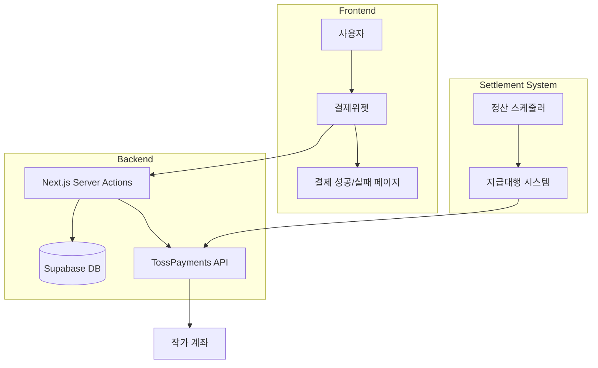
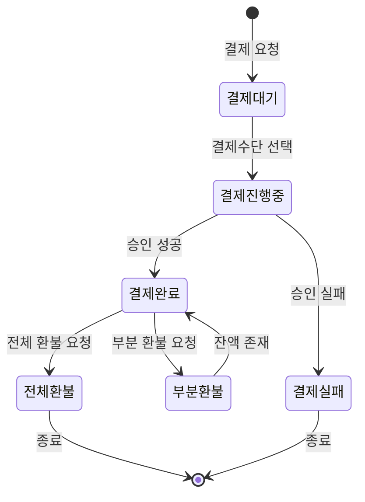

# TossPayments 구현 가이드 - Photo4You

## 📋 목차
1. [환경설정 및 설치](#환경설정-및-설치)
2. [시스템 아키텍처](#시스템-아키텍처)
3. [데이터베이스 스키마](#데이터베이스-스키마)
4. [결제 플로우 구현](#결제-플로우-구현)
5. [지급 자동화 시스템](#지급-자동화-시스템)
6. [보안 및 암호화](#보안-및-암호화)
7. [테스트 시나리오](#테스트-시나리오)

## 환경설정 및 설치

### 1. 패키지 설치

```bash
# TossPayments SDK 및 관련 패키지 설치
npm install @tosspayments/tosspayments-sdk

# 암호화 관련 패키지 (지급 자동화용)
npm install node-jose crypto
npm install -D @types/node-jose
```

### 2. 환경변수 설정

`.env.local` 파일에 다음 환경변수를 추가하세요:

```bash
# TossPayments 설정
NEXT_PUBLIC_TOSS_CLIENT_KEY=test_gck_docs_... # 개발환경 클라이언트 키
# NEXT_PUBLIC_TOSS_CLIENT_KEY=live_gck_... # 운영환경 클라이언트 키

TOSS_SECRET_KEY=test_gsk_docs_... # 개발환경 시크릿 키
# TOSS_SECRET_KEY=live_gsk_... # 운영환경 시크릿 키

TOSS_WEBHOOK_SECRET=your_webhook_secret_key # 웹훅 검증용 시크릿

# 지급 자동화 설정 (선택사항)
TOSS_JWE_SECRET_KEY=your_jwe_secret_key # JWE 암호화용 시크릿
TOSS_JWE_KEY_ID=your_key_id # JWE 키 ID

# 앱 URL (결제 성공/실패 리디렉션용)
NEXT_PUBLIC_APP_URL=http://localhost:3000 # 개발환경
# NEXT_PUBLIC_APP_URL=https://photo4you.com # 운영환경
```

### 3. TossPayments 개발자센터 설정

1. **TossPayments 개발자센터** 가입
   - https://developers.tosspayments.com/ 에서 계정 생성
   - 본인인증 및 사업자 정보 등록

2. **앱 등록 및 키 발급**
   ```
   애플리케이션 정보:
   - 앱 이름: Photo4You
   - 결제 환경: 테스트/실 서비스
   - 도메인: localhost:3000 (개발) / photo4you.com (운영)
   ```

3. **웹훅 URL 설정**
   ```
   웹훅 URL: https://photo4you.com/api/webhooks/toss
   이벤트: 모든 결제 이벤트 선택
   ```

4. **결제수단 활성화**
   - 카드결제, 계좌이체, 가상계좌, 휴대폰 결제 등
   - 토스페이, 네이버페이, 카카오페이 등 간편결제

### 4. Supabase 데이터베이스 마이그레이션

아래 SQL을 Supabase Dashboard에서 실행하여 결제 관련 테이블을 생성/수정:

```sql
-- TossPayments 전용 컬럼 추가
ALTER TABLE payments 
ADD COLUMN IF NOT EXISTS toss_payment_key VARCHAR(200) UNIQUE,
ADD COLUMN IF NOT EXISTS toss_order_id VARCHAR(100) UNIQUE,
ADD COLUMN IF NOT EXISTS customer_key VARCHAR(100),
ADD COLUMN IF NOT EXISTS card_info JSONB,
ADD COLUMN IF NOT EXISTS virtual_account_info JSONB,
ADD COLUMN IF NOT EXISTS easy_pay_info JSONB;

-- 인덱스 생성
CREATE INDEX IF NOT EXISTS idx_payments_toss_payment_key ON payments(toss_payment_key);
CREATE INDEX IF NOT EXISTS idx_payments_customer_key ON payments(customer_key);
```

### 5. 개발 환경 실행

```bash
# 개발 서버 시작
npm run dev

# 웹훅 테스트를 위한 ngrok 설정 (선택사항)
npm install -g ngrok
ngrok http 3000
# 생성된 URL을 TossPayments 웹훅 URL에 등록
```

### 6. 구현 확인 체크리스트

- [ ] 환경변수 모두 설정됨
- [ ] TossPayments 개발자센터에서 키 발급 완료
- [ ] 웹훅 URL 등록 완료
- [ ] 데이터베이스 마이그레이션 완료
- [ ] 개발 서버 정상 실행
- [ ] 결제 위젯 로딩 확인
- [ ] 테스트 결제 진행 가능

## 시스템 아키텍처

### 전체 시스템 구조


### 결제 상태 플로우


## 데이터베이스 스키마

### 1. 결제 관련 테이블 수정

```sql
-- payments 테이블 수정 (TossPayments 전용)
ALTER TABLE payments 
ADD COLUMN toss_payment_key VARCHAR(200) UNIQUE,
ADD COLUMN toss_order_id VARCHAR(100) UNIQUE,
ADD COLUMN toss_transaction_key VARCHAR(200),
ADD COLUMN toss_approval_number VARCHAR(50),
ADD COLUMN payment_type VARCHAR(50), -- NORMAL, BILLING, BRANDPAY
ADD COLUMN easy_pay JSONB, -- 간편결제 정보
ADD COLUMN card JSONB, -- 카드 상세 정보
ADD COLUMN virtual_account JSONB, -- 가상계좌 정보
ADD COLUMN mobile_phone JSONB, -- 휴대폰 결제 정보
ADD COLUMN culture_expense BOOLEAN DEFAULT false, -- 문화비 결제 여부
ADD COLUMN requested_at TIMESTAMPTZ,
ADD COLUMN approved_at TIMESTAMPTZ,
ADD COLUMN webhook_verified BOOLEAN DEFAULT false;

-- 인덱스 추가
CREATE INDEX idx_payments_toss_payment_key ON payments(toss_payment_key);
CREATE INDEX idx_payments_toss_order_id ON payments(toss_order_id);
CREATE INDEX idx_payments_created_at ON payments(created_at);
CREATE INDEX idx_payments_photographer_id ON payments(photographer_id);
```

### 2. 정산 관련 테이블 수정

```sql
-- settlements 테이블 수정 (TossPayments 지급대행용)
ALTER TABLE settlements
ADD COLUMN toss_payout_id VARCHAR(100),
ADD COLUMN toss_ref_payout_id VARCHAR(100),
ADD COLUMN payout_type VARCHAR(20) DEFAULT 'SCHEDULED', -- EXPRESS, SCHEDULED
ADD COLUMN payout_date DATE,
ADD COLUMN payout_status VARCHAR(20), -- REQUESTED, IN_PROGRESS, COMPLETED, FAILED, CANCELED
ADD COLUMN payout_error JSONB,
ADD COLUMN payout_requested_at TIMESTAMPTZ,
ADD COLUMN payout_completed_at TIMESTAMPTZ;

-- 인덱스 추가
CREATE INDEX idx_settlements_toss_payout_id ON settlements(toss_payout_id);
CREATE INDEX idx_settlements_payout_status ON settlements(payout_status);
CREATE INDEX idx_settlements_payout_date ON settlements(payout_date);
```

### 3. 작가 계좌 정보 테이블 (신규)

```sql
-- 작가 정산 계좌 정보
CREATE TABLE photographer_bank_accounts (
  id UUID PRIMARY KEY DEFAULT gen_random_uuid(),
  photographer_id UUID NOT NULL REFERENCES photographers(id),
  
  -- 계좌 정보
  bank_code VARCHAR(10) NOT NULL,
  bank_name VARCHAR(50) NOT NULL,
  account_number VARCHAR(50) NOT NULL,
  account_holder VARCHAR(100) NOT NULL,
  
  -- TossPayments 셀러 정보
  toss_seller_id VARCHAR(100),
  toss_ref_seller_id VARCHAR(100),
  seller_status VARCHAR(50), -- APPROVAL_REQUIRED, PARTIALLY_APPROVED, KYC_REQUIRED, APPROVED
  business_type VARCHAR(50), -- INDIVIDUAL, INDIVIDUAL_BUSINESS, CORPORATE
  
  -- 사업자 정보
  business_registration_number VARCHAR(20),
  company_name VARCHAR(100),
  representative_name VARCHAR(100),
  
  -- KYC 정보
  kyc_verified BOOLEAN DEFAULT false,
  kyc_verified_at TIMESTAMPTZ,
  kyc_expires_at TIMESTAMPTZ,
  
  -- 주간 지급 한도
  weekly_limit_amount INTEGER DEFAULT 10000000, -- 1천만원
  weekly_paid_amount INTEGER DEFAULT 0,
  weekly_reset_at TIMESTAMPTZ,
  
  is_primary BOOLEAN DEFAULT false,
  is_active BOOLEAN DEFAULT true,
  created_at TIMESTAMPTZ DEFAULT NOW(),
  updated_at TIMESTAMPTZ DEFAULT NOW(),
  
  UNIQUE(photographer_id, account_number)
);

-- 인덱스
CREATE INDEX idx_photographer_bank_accounts_photographer ON photographer_bank_accounts(photographer_id);
CREATE INDEX idx_photographer_bank_accounts_toss_seller ON photographer_bank_accounts(toss_seller_id);
```

### 4. 결제 로그 테이블 (확장)

```sql
-- payment_logs 테이블 수정
ALTER TABLE payment_logs
ADD COLUMN webhook_event_type VARCHAR(50),
ADD COLUMN webhook_event_id VARCHAR(100),
ADD COLUMN webhook_data JSONB,
ADD COLUMN idempotency_key VARCHAR(100),
ADD COLUMN processed_at TIMESTAMPTZ;

-- 웹훅 이벤트 중복 방지
CREATE UNIQUE INDEX idx_payment_logs_webhook_event ON payment_logs(webhook_event_id) 
WHERE webhook_event_id IS NOT NULL;
```

## 결제 플로우 구현

### 1. 환경 변수 설정

```bash
# .env.local
# TossPayments API Keys
NEXT_PUBLIC_TOSS_CLIENT_KEY=test_ck_YOUR_CLIENT_KEY
TOSS_SECRET_KEY=test_sk_YOUR_SECRET_KEY
TOSS_WEBHOOK_SECRET=YOUR_WEBHOOK_SECRET

# TossPayments 지급대행
TOSS_PAYOUT_SECRET_KEY=test_sk_YOUR_PAYOUT_KEY
TOSS_SECURITY_KEY=YOUR_64_CHAR_HEX_KEY

# 결제 URL 설정
NEXT_PUBLIC_APP_URL=http://localhost:3000
NEXT_PUBLIC_TOSS_SUCCESS_URL=http://localhost:3000/payment/success
NEXT_PUBLIC_TOSS_FAIL_URL=http://localhost:3000/payment/fail
```

### 2. SDK 초기화 및 타입 정의

```typescript
// lib/toss/types.ts
export interface TossPaymentRequest {
  amount: number;
  orderId: string;
  orderName: string;
  customerName?: string;
  customerEmail?: string;
  customerMobilePhone?: string;
  successUrl?: string;
  failUrl?: string;
  metadata?: Record<string, any>;
}

export interface TossPaymentResponse {
  paymentKey: string;
  orderId: string;
  orderName: string;
  method: string;
  status: 'READY' | 'IN_PROGRESS' | 'WAITING_FOR_DEPOSIT' | 'DONE' | 'CANCELED' | 'PARTIAL_CANCELED' | 'ABORTED' | 'EXPIRED';
  requestedAt: string;
  approvedAt?: string;
  card?: TossCardInfo;
  virtualAccount?: TossVirtualAccountInfo;
  easyPay?: TossEasyPayInfo;
  // ... 추가 필드
}

export interface TossCardInfo {
  company: string;
  number: string;
  installmentPlanMonths: number;
  isInterestFree: boolean;
  approveNo: string;
  cardType: string;
  ownerType: string;
  acquireStatus: string;
}

// lib/toss/client.ts
import { loadTossPayments } from '@tosspayments/tosspayments-sdk';

let tossPaymentsPromise: Promise<any> | null = null;

export const getTossPayments = () => {
  if (!tossPaymentsPromise) {
    const clientKey = process.env.NEXT_PUBLIC_TOSS_CLIENT_KEY!;
    tossPaymentsPromise = loadTossPayments(clientKey);
  }
  return tossPaymentsPromise;
};
```

### 3. 결제위젯 컴포넌트

```typescript
// components/payment/toss-payment-widget.tsx
'use client';

import { useEffect, useRef, useState } from 'react';
import { getTossPayments } from '@/lib/toss/client';
import { nanoid } from 'nanoid';
import { useRouter } from 'next/navigation';

interface TossPaymentWidgetProps {
  inquiry: {
    id: string;
    name: string;
    phone: string;
    email?: string;
  };
  product: {
    id: string;
    name: string;
    price: number;
  };
  photographer: {
    id: string;
    name: string;
  };
  customerKey: string;
}

export function TossPaymentWidget({
  inquiry,
  product,
  photographer,
  customerKey
}: TossPaymentWidgetProps) {
  const router = useRouter();
  const [widgets, setWidgets] = useState<any>(null);
  const [ready, setReady] = useState(false);
  const [amount, setAmount] = useState(product.price);
  const paymentMethodsWidgetRef = useRef<any>(null);
  const agreementWidgetRef = useRef<any>(null);

  // 결제위젯 초기화
  useEffect(() => {
    async function initWidgets() {
      try {
        const tossPayments = await getTossPayments();
        const widgets = tossPayments.widgets({ 
          customerKey,
          // 브랜드페이 사용시
          // brandpayVariantKey: "DEFAULT"
        });
        
        setWidgets(widgets);
      } catch (error) {
        console.error('결제위젯 초기화 실패:', error);
      }
    }
    
    initWidgets();
  }, [customerKey]);

  // 위젯 렌더링
  useEffect(() => {
    if (!widgets) return;

    async function renderWidgets() {
      try {
        // 금액 설정
        await widgets.setAmount({
          currency: 'KRW',
          value: amount,
        });

        // 결제 방법 위젯 렌더링
        if (!paymentMethodsWidgetRef.current) {
          paymentMethodsWidgetRef.current = await widgets.renderPaymentMethods({
            selector: '#payment-methods',
            variantKey: 'DEFAULT',
          });
        }

        // 약관 위젯 렌더링
        if (!agreementWidgetRef.current) {
          agreementWidgetRef.current = await widgets.renderAgreement({
            selector: '#agreement',
            variantKey: 'AGREEMENT',
          });
        }

        setReady(true);
      } catch (error) {
        console.error('위젯 렌더링 실패:', error);
      }
    }

    renderWidgets();
  }, [widgets, amount]);

  // 쿠폰 적용
  const applyCoupon = async (discountAmount: number) => {
    const newAmount = product.price - discountAmount;
    setAmount(Math.max(0, newAmount));
    
    if (widgets) {
      await widgets.setAmount({
        currency: 'KRW',
        value: Math.max(0, newAmount),
      });
    }
  };

  // 결제 요청
  const handlePayment = async () => {
    if (!widgets) return;

    try {
      // 결제 요청
      await widgets.requestPayment({
        orderId: `ORDER_${nanoid()}`,
        orderName: `${product.name} - ${photographer.name}`,
        successUrl: `${window.location.origin}/payment/success`,
        failUrl: `${window.location.origin}/payment/fail`,
        customerEmail: inquiry.email,
        customerName: inquiry.name,
        customerMobilePhone: inquiry.phone,
        // 메타데이터로 추가 정보 전달
        metadata: {
          inquiryId: inquiry.id,
          productId: product.id,
          photographerId: photographer.id,
        },
      });
    } catch (error: any) {
      // 에러 처리
      if (error.code === 'USER_CANCEL') {
        console.log('사용자가 결제를 취소했습니다.');
      } else if (error.code === 'INVALID_CARD_COMPANY') {
        alert('유효하지 않은 카드입니다.');
      } else {
        console.error('결제 요청 실패:', error);
        alert(error.message || '결제 처리 중 오류가 발생했습니다.');
      }
    }
  };

  return (
    <div className="w-full max-w-2xl mx-auto p-6 space-y-6">
      {/* 주문 정보 */}
      <div className="bg-white rounded-lg shadow p-6">
        <h2 className="text-lg font-semibold mb-4">주문 정보</h2>
        <div className="space-y-2 text-sm">
          <div className="flex justify-between">
            <span className="text-gray-600">상품명</span>
            <span className="font-medium">{product.name}</span>
          </div>
          <div className="flex justify-between">
            <span className="text-gray-600">작가</span>
            <span className="font-medium">{photographer.name}</span>
          </div>
          <div className="flex justify-between">
            <span className="text-gray-600">결제 금액</span>
            <span className="font-bold text-lg">
              {amount.toLocaleString()}원
            </span>
          </div>
        </div>
      </div>

      {/* 결제 수단 선택 */}
      <div className="bg-white rounded-lg shadow p-6">
        <h2 className="text-lg font-semibold mb-4">결제 수단</h2>
        <div id="payment-methods" />
      </div>

      {/* 약관 동의 */}
      <div className="bg-white rounded-lg shadow p-6">
        <h2 className="text-lg font-semibold mb-4">약관 동의</h2>
        <div id="agreement" />
      </div>

      {/* 결제 버튼 */}
      <button
        onClick={handlePayment}
        disabled={!ready}
        className="w-full py-4 px-6 bg-blue-600 text-white text-lg font-semibold rounded-lg hover:bg-blue-700 disabled:opacity-50 disabled:cursor-not-allowed transition-colors"
      >
        {amount.toLocaleString()}원 결제하기
      </button>
    </div>
  );
}
```

### 4. 결제 승인 처리 (Server Action)

```typescript
// lib/actions/toss-payment.ts
'use server';

import { createClient } from '@/lib/supabase/server';
import { nanoid } from 'nanoid';

const TOSS_API_BASE = 'https://api.tosspayments.com/v1';

interface ConfirmPaymentParams {
  paymentKey: string;
  orderId: string;
  amount: number;
}

// Base64 인코딩 헬퍼
function encodeSecretKey(secretKey: string): string {
  return Buffer.from(secretKey + ':').toString('base64');
}

// 결제 승인
export async function confirmPayment(params: ConfirmPaymentParams) {
  const { paymentKey, orderId, amount } = params;
  const supabase = await createClient();

  try {
    // 1. TossPayments 결제 승인 API 호출
    const response = await fetch(`${TOSS_API_BASE}/payments/confirm`, {
      method: 'POST',
      headers: {
        'Authorization': `Basic ${encodeSecretKey(process.env.TOSS_SECRET_KEY!)}`,
        'Content-Type': 'application/json',
      },
      body: JSON.stringify({
        paymentKey,
        orderId,
        amount,
      }),
    });

    const result = await response.json();

    if (!response.ok) {
      throw new Error(result.message || '결제 승인 실패');
    }

    // 2. 메타데이터에서 관련 정보 추출
    const metadata = result.metadata || {};
    const { inquiryId, productId, photographerId } = metadata;

    // 3. 결제 정보 DB 저장
    const { data: payment, error: paymentError } = await supabase
      .from('payments')
      .insert({
        // 기본 정보
        order_id: orderId,
        amount,
        currency: 'KRW',
        provider: 'tosspayments',
        
        // TossPayments 전용 필드
        toss_payment_key: paymentKey,
        toss_order_id: orderId,
        toss_transaction_key: result.transactionKey,
        toss_approval_number: result.approveNo,
        payment_type: result.type || 'NORMAL',
        payment_method: result.method,
        
        // 연결 정보
        inquiry_id: inquiryId,
        product_id: productId,
        photographer_id: photographerId,
        
        // 구매자 정보
        buyer_name: result.customerName,
        buyer_email: result.customerEmail,
        buyer_tel: result.customerMobilePhone,
        
        // 상태
        status: 'paid',
        paid_at: result.approvedAt,
        requested_at: result.requestedAt,
        
        // 상세 정보
        card: result.card ? {
          company: result.card.company,
          number: result.card.number,
          installmentPlanMonths: result.card.installmentPlanMonths,
          isInterestFree: result.card.isInterestFree,
          cardType: result.card.cardType,
          ownerType: result.card.ownerType,
        } : null,
        virtual_account: result.virtualAccount || null,
        easy_pay: result.easyPay || null,
        mobile_phone: result.mobilePhone || null,
        culture_expense: result.cultureExpense || false,
        
        // 영수증
        receipt_url: result.receipt?.url,
        raw_response: result,
      })
      .select()
      .single();

    if (paymentError) {
      console.error('결제 정보 저장 실패:', paymentError);
      // 결제는 성공했지만 DB 저장 실패 - 별도 처리 필요
      await logPaymentError(orderId, paymentError);
    }

    // 4. 문의 상태 업데이트
    if (inquiryId) {
      await supabase
        .from('inquiries')
        .update({ 
          status: 'reserved',
          updated_at: new Date().toISOString()
        })
        .eq('id', inquiryId);
    }

    // 5. 작가에게 알림 발송
    if (photographerId) {
      await sendPhotographerNotification(photographerId, payment);
    }

    return { 
      success: true, 
      data: payment,
      receiptUrl: result.receipt?.url 
    };

  } catch (error) {
    console.error('결제 승인 에러:', error);
    
    // 에러 로깅
    await supabase
      .from('payment_logs')
      .insert({
        event_type: 'payment_confirm_error',
        provider: 'tosspayments',
        response_data: {
          orderId,
          paymentKey,
          error: error instanceof Error ? error.message : 'Unknown error',
        },
      });

    return { 
      success: false, 
      error: error instanceof Error ? error.message : '결제 승인 중 오류가 발생했습니다.' 
    };
  }
}

// 결제 조회
export async function getPayment(paymentKeyOrOrderId: string) {
  try {
    const response = await fetch(
      `${TOSS_API_BASE}/payments/${paymentKeyOrOrderId}`,
      {
        headers: {
          'Authorization': `Basic ${encodeSecretKey(process.env.TOSS_SECRET_KEY!)}`,
        },
      }
    );

    if (!response.ok) {
      throw new Error('결제 조회 실패');
    }

    return await response.json();
  } catch (error) {
    console.error('결제 조회 에러:', error);
    throw error;
  }
}

// 결제 취소
export async function cancelPayment(
  paymentKey: string,
  cancelReason: string,
  cancelAmount?: number,
  refundReceiveAccount?: {
    bank: string;
    accountNumber: string;
    holderName: string;
  }
) {
  const supabase = await createClient();

  try {
    // 1. 결제 정보 조회
    const { data: payment } = await supabase
      .from('payments')
      .select('*')
      .eq('toss_payment_key', paymentKey)
      .single();

    if (!payment) {
      throw new Error('결제 정보를 찾을 수 없습니다.');
    }

    // 2. TossPayments 취소 API 호출
    const cancelData: any = {
      cancelReason,
    };

    // 부분 취소인 경우
    if (cancelAmount) {
      cancelData.cancelAmount = cancelAmount;
    }

    // 가상계좌 환불계좌 정보
    if (refundReceiveAccount) {
      cancelData.refundReceiveAccount = refundReceiveAccount;
    }

    const response = await fetch(
      `${TOSS_API_BASE}/payments/${paymentKey}/cancel`,
      {
        method: 'POST',
        headers: {
          'Authorization': `Basic ${encodeSecretKey(process.env.TOSS_SECRET_KEY!)}`,
          'Content-Type': 'application/json',
          'Idempotency-Key': nanoid(), // 중복 요청 방지
        },
        body: JSON.stringify(cancelData),
      }
    );

    const result = await response.json();

    if (!response.ok) {
      throw new Error(result.message || '결제 취소 실패');
    }

    // 3. 환불 정보 DB 저장
    const { error: refundError } = await supabase
      .from('refunds')
      .insert({
        payment_id: payment.id,
        refund_type: cancelAmount ? 'partial' : 'full',
        refund_category: 'customer_request',
        refund_reason: cancelReason,
        original_amount: payment.amount,
        refund_amount: cancelAmount || payment.amount,
        remaining_amount: payment.amount - (cancelAmount || payment.amount),
        provider: 'tosspayments',
        provider_refund_id: result.cancels?.[0]?.transactionKey,
        status: 'completed',
        processed_at: new Date().toISOString(),
        refund_response: result,
        refund_holder: refundReceiveAccount?.holderName,
        refund_account: refundReceiveAccount?.accountNumber,
        refund_bank_code: refundReceiveAccount?.bank,
      });

    if (refundError) {
      console.error('환불 정보 저장 실패:', refundError);
    }

    // 4. 결제 상태 업데이트
    await supabase
      .from('payments')
      .update({
        status: result.status === 'CANCELED' ? 'refunded' : 'paid',
        cancelled_at: result.status === 'CANCELED' ? new Date().toISOString() : null,
        updated_at: new Date().toISOString(),
      })
      .eq('id', payment.id);

    return { success: true, data: result };

  } catch (error) {
    console.error('결제 취소 에러:', error);
    return { 
      success: false, 
      error: error instanceof Error ? error.message : '결제 취소 중 오류가 발생했습니다.' 
    };
  }
}

// 빌링키 발급
export async function issueBillingKey(
  customerKey: string,
  cardNumber: string,
  cardExpirationYear: string,
  cardExpirationMonth: string,
  cardPassword: string,
  customerIdentityNumber: string
) {
  try {
    const response = await fetch(
      `${TOSS_API_BASE}/billing/authorizations/card`,
      {
        method: 'POST',
        headers: {
          'Authorization': `Basic ${encodeSecretKey(process.env.TOSS_SECRET_KEY!)}`,
          'Content-Type': 'application/json',
        },
        body: JSON.stringify({
          customerKey,
          cardNumber,
          cardExpirationYear,
          cardExpirationMonth,
          cardPassword,
          customerIdentityNumber,
        }),
      }
    );

    const result = await response.json();

    if (!response.ok) {
      throw new Error(result.message || '빌링키 발급 실패');
    }

    return { success: true, billingKey: result.billingKey };

  } catch (error) {
    console.error('빌링키 발급 에러:', error);
    return { 
      success: false, 
      error: error instanceof Error ? error.message : '빌링키 발급 중 오류가 발생했습니다.' 
    };
  }
}

// 작가 알림 발송
async function sendPhotographerNotification(
  photographerId: string, 
  payment: any
) {
  // 이메일/SMS 알림 로직 구현
  console.log(`작가 ${photographerId}에게 결제 알림 발송`, payment);
}

// 결제 에러 로깅
async function logPaymentError(orderId: string, error: any) {
  const supabase = await createClient();
  await supabase
    .from('payment_logs')
    .insert({
      event_type: 'payment_db_error',
      provider: 'tosspayments',
      response_data: {
        orderId,
        error: error.message || 'Unknown error',
        timestamp: new Date().toISOString(),
      },
    });
}
```

## 지급 자동화 시스템

### 1. 지급대행 보안 설정

```typescript
// lib/toss/payout-security.ts
import { JWE, JWK } from 'node-jose';
import { v4 as uuidv4 } from 'uuid';

// 보안 키를 바이트 배열로 변환
function hexToBytes(hex: string): Buffer {
  return Buffer.from(hex, 'hex');
}

// JWE 암호화
export async function encryptPayoutRequest(
  payload: any,
  securityKey: string
): Promise<string> {
  const key = await JWK.asKey({
    kty: 'oct',
    k: Buffer.from(hexToBytes(securityKey)).toString('base64'),
    alg: 'dir',
    use: 'enc',
  });

  const jwe = await JWE.createEncrypt(
    {
      format: 'compact',
      contentAlg: 'A256GCM',
      fields: {
        alg: 'dir',
        enc: 'A256GCM',
        iat: new Date().toISOString(),
        nonce: uuidv4(),
      },
    },
    key
  )
    .update(JSON.stringify(payload))
    .final();

  return jwe;
}

// JWE 복호화
export async function decryptPayoutResponse(
  encryptedData: string,
  securityKey: string
): Promise<any> {
  const key = await JWK.asKey({
    kty: 'oct',
    k: Buffer.from(hexToBytes(securityKey)).toString('base64'),
    alg: 'dir',
    use: 'enc',
  });

  const decrypted = await JWE.createDecrypt(key)
    .decrypt(encryptedData);

  return JSON.parse(decrypted.payload.toString());
}
```

### 2. 셀러(작가) 등록

```typescript
// lib/actions/toss-seller.ts
'use server';

import { createClient } from '@/lib/supabase/server';
import { encryptPayoutRequest, decryptPayoutResponse } from '@/lib/toss/payout-security';

const TOSS_PAYOUT_API = 'https://api.tosspayments.com/v2';

// 작가를 TossPayments 셀러로 등록
export async function registerPhotographerAsSeller(photographerId: string) {
  const supabase = await createClient();

  try {
    // 1. 작가 정보 조회
    const { data: photographer } = await supabase
      .from('photographers')
      .select('*, photographer_bank_accounts(*)')
      .eq('id', photographerId)
      .single();

    if (!photographer) {
      throw new Error('작가 정보를 찾을 수 없습니다.');
    }

    const bankAccount = photographer.photographer_bank_accounts?.[0];
    if (!bankAccount) {
      throw new Error('계좌 정보가 등록되지 않았습니다.');
    }

    // 2. 이미 셀러로 등록되어 있는지 확인
    if (bankAccount.toss_seller_id) {
      return { 
        success: true, 
        sellerId: bankAccount.toss_seller_id,
        status: bankAccount.seller_status 
      };
    }

    // 3. 셀러 등록 요청 데이터 준비
    const sellerData = {
      refSellerId: `PHOTO4YOU_${photographerId}`,
      businessType: bankAccount.business_type || 'INDIVIDUAL',
      
      // 사업자 정보 (개인사업자/법인)
      company: bankAccount.business_registration_number ? {
        name: bankAccount.company_name,
        representativeName: bankAccount.representative_name,
        businessRegistrationNumber: bankAccount.business_registration_number,
        email: photographer.email,
        phone: photographer.phone,
      } : undefined,
      
      // 개인 정보 (개인)
      individual: !bankAccount.business_registration_number ? {
        name: photographer.name,
        residentRegistrationNumber: '', // 별도 수집 필요
        email: photographer.email,
        phone: photographer.phone,
      } : undefined,
      
      // 계좌 정보
      account: {
        bankCode: bankAccount.bank_code,
        accountNumber: bankAccount.account_number,
        holderName: bankAccount.account_holder,
      },
      
      metadata: {
        photographerId,
        registeredAt: new Date().toISOString(),
      },
    };

    // 4. 요청 암호화
    const encryptedRequest = await encryptPayoutRequest(
      sellerData,
      process.env.TOSS_SECURITY_KEY!
    );

    // 5. TossPayments API 호출
    const response = await fetch(`${TOSS_PAYOUT_API}/sellers`, {
      method: 'POST',
      headers: {
        'Authorization': `Basic ${Buffer.from(process.env.TOSS_PAYOUT_SECRET_KEY! + ':').toString('base64')}`,
        'Content-Type': 'text/plain',
        'TossPayments-api-security-mode': 'ENCRYPTION',
      },
      body: encryptedRequest,
    });

    const encryptedResponse = await response.text();

    if (!response.ok) {
      const errorData = await decryptPayoutResponse(
        encryptedResponse,
        process.env.TOSS_SECURITY_KEY!
      );
      throw new Error(errorData.message || '셀러 등록 실패');
    }

    // 6. 응답 복호화
    const result = await decryptPayoutResponse(
      encryptedResponse,
      process.env.TOSS_SECURITY_KEY!
    );

    // 7. DB 업데이트
    await supabase
      .from('photographer_bank_accounts')
      .update({
        toss_seller_id: result.entityBody.id,
        toss_ref_seller_id: result.entityBody.refSellerId,
        seller_status: result.entityBody.status,
        updated_at: new Date().toISOString(),
      })
      .eq('id', bankAccount.id);

    return {
      success: true,
      sellerId: result.entityBody.id,
      status: result.entityBody.status,
    };

  } catch (error) {
    console.error('셀러 등록 에러:', error);
    return {
      success: false,
      error: error instanceof Error ? error.message : '셀러 등록 중 오류가 발생했습니다.',
    };
  }
}

// 정산 잔액 조회
export async function getSettlementBalance() {
  try {
    const response = await fetch(`${TOSS_PAYOUT_API}/balances`, {
      headers: {
        'Authorization': `Basic ${Buffer.from(process.env.TOSS_PAYOUT_SECRET_KEY! + ':').toString('base64')}`,
      },
    });

    const result = await response.json();

    if (!response.ok) {
      throw new Error(result.message || '잔액 조회 실패');
    }

    return {
      success: true,
      pendingAmount: result.entityBody.pendingAmount.value,
      availableAmount: result.entityBody.availableAmount.value,
    };

  } catch (error) {
    console.error('잔액 조회 에러:', error);
    return {
      success: false,
      error: error instanceof Error ? error.message : '잔액 조회 중 오류가 발생했습니다.',
    };
  }
}
```

### 3. 자동 정산 처리

```typescript
// lib/actions/toss-settlement.ts
'use server';

import { createClient } from '@/lib/supabase/server';
import { encryptPayoutRequest, decryptPayoutResponse } from '@/lib/toss/payout-security';
import { nanoid } from 'nanoid';
import { addDays, format, startOfMonth, endOfMonth } from 'date-fns';

const TOSS_PAYOUT_API = 'https://api.tosspayments.com/v2';

// 월별 자동 정산 처리
export async function processMonthlySettlements() {
  const supabase = await createClient();
  
  try {
    // 1. 정산 대상 기간 설정 (전월)
    const now = new Date();
    const settlementMonth = addDays(startOfMonth(now), -1); // 전월
    const startDate = startOfMonth(settlementMonth);
    const endDate = endOfMonth(settlementMonth);

    // 2. 정산 대상 결제 내역 조회
    const { data: payments } = await supabase
      .from('payments')
      .select(`
        *,
        photographers!inner(
          id,
          name,
          photographer_bank_accounts(*)
        ),
        products!inner(
          id,
          name,
          price
        )
      `)
      .eq('status', 'paid')
      .gte('paid_at', startDate.toISOString())
      .lte('paid_at', endDate.toISOString())
      .is('settlement_id', null); // 아직 정산되지 않은 건

    if (!payments || payments.length === 0) {
      console.log('정산할 결제 내역이 없습니다.');
      return { success: true, message: '정산할 내역 없음' };
    }

    // 3. 작가별로 결제 내역 그룹핑
    const photographerPayments = payments.reduce((acc: any, payment) => {
      const photographerId = payment.photographer_id;
      if (!acc[photographerId]) {
        acc[photographerId] = {
          photographer: payment.photographers,
          payments: [],
          totalAmount: 0,
        };
      }
      acc[photographerId].payments.push(payment);
      acc[photographerId].totalAmount += payment.amount;
      return acc;
    }, {});

    // 4. 각 작가별 정산 처리
    const settlementResults = [];
    
    for (const [photographerId, data] of Object.entries(photographerPayments) as any) {
      const result = await createSettlementForPhotographer(
        photographerId,
        data.photographer,
        data.payments,
        data.totalAmount,
        format(settlementMonth, 'yyyy-MM')
      );
      settlementResults.push(result);
    }

    return {
      success: true,
      settlements: settlementResults,
    };

  } catch (error) {
    console.error('월별 정산 처리 에러:', error);
    return {
      success: false,
      error: error instanceof Error ? error.message : '정산 처리 중 오류가 발생했습니다.',
    };
  }
}

// 개별 작가 정산 생성 및 지급 요청
async function createSettlementForPhotographer(
  photographerId: string,
  photographer: any,
  payments: any[],
  totalAmount: number,
  settlementPeriod: string
) {
  const supabase = await createClient();

  try {
    // 1. 계좌 정보 확인
    const bankAccount = photographer.photographer_bank_accounts?.[0];
    if (!bankAccount || !bankAccount.toss_seller_id) {
      throw new Error(`작가 ${photographer.name}의 셀러 정보가 없습니다.`);
    }

    // 2. 수수료 계산 (예: 플랫폼 수수료 20%)
    const platformFeeRate = 0.20;
    const platformFee = Math.floor(totalAmount * platformFeeRate);
    const gatewayFee = Math.floor(totalAmount * 0.03); // PG 수수료 3%
    const taxAmount = Math.floor((totalAmount - platformFee - gatewayFee) * 0.033); // 원천세 3.3%
    const finalAmount = totalAmount - platformFee - gatewayFee - taxAmount;

    // 3. 정산 레코드 생성
    const { data: settlement, error: settlementError } = await supabase
      .from('settlements')
      .insert({
        photographer_id: photographerId,
        settlement_date: new Date().toISOString(),
        settlement_period: settlementPeriod,
        total_payment_amount: totalAmount,
        total_platform_fee: platformFee,
        total_gateway_fee: gatewayFee,
        total_tax_amount: taxAmount,
        final_settlement_amount: finalAmount,
        payment_count: payments.length,
        settlement_item_count: payments.length,
        status: 'pending',
        toss_ref_payout_id: `SETTLEMENT_${nanoid()}`,
        payout_type: 'SCHEDULED',
        payout_date: addDays(new Date(), 7), // 7일 후 지급
        settlement_data: {
          payments: payments.map(p => ({
            id: p.id,
            order_id: p.order_id,
            amount: p.amount,
            paid_at: p.paid_at,
          })),
        },
      })
      .select()
      .single();

    if (settlementError) {
      throw settlementError;
    }

    // 4. 주간 한도 확인
    const weeklyLimit = bankAccount.weekly_limit_amount || 10000000; // 1천만원
    if (finalAmount > weeklyLimit) {
      // KYC 필요
      await supabase
        .from('settlements')
        .update({
          status: 'kyc_required',
          admin_note: `주간 한도 초과 (한도: ${weeklyLimit}, 요청: ${finalAmount})`,
        })
        .eq('id', settlement.id);

      return {
        settlementId: settlement.id,
        status: 'kyc_required',
        message: 'KYC 심사가 필요합니다.',
      };
    }

    // 5. 지급대행 요청 데이터 준비
    const payoutData = {
      refPayoutId: settlement.toss_ref_payout_id,
      destination: bankAccount.toss_seller_id,
      scheduleType: 'SCHEDULED',
      payoutDate: format(addDays(new Date(), 7), 'yyyy-MM-dd'),
      amount: {
        currency: 'KRW',
        value: finalAmount,
      },
      transactionDescription: `${settlementPeriod} 정산금`,
      metadata: {
        settlementId: settlement.id,
        photographerId,
        period: settlementPeriod,
      },
    };

    // 6. 요청 암호화
    const encryptedRequest = await encryptPayoutRequest(
      payoutData,
      process.env.TOSS_SECURITY_KEY!
    );

    // 7. TossPayments 지급대행 API 호출
    const response = await fetch(`${TOSS_PAYOUT_API}/payouts`, {
      method: 'POST',
      headers: {
        'Authorization': `Basic ${Buffer.from(process.env.TOSS_PAYOUT_SECRET_KEY! + ':').toString('base64')}`,
        'Content-Type': 'text/plain',
        'TossPayments-api-security-mode': 'ENCRYPTION',
        'Idempotency-Key': settlement.toss_ref_payout_id, // 중복 방지
      },
      body: encryptedRequest,
    });

    const encryptedResponse = await response.text();

    if (!response.ok) {
      const errorData = await decryptPayoutResponse(
        encryptedResponse,
        process.env.TOSS_SECURITY_KEY!
      );
      throw new Error(errorData.message || '지급대행 요청 실패');
    }

    // 8. 응답 복호화
    const result = await decryptPayoutResponse(
      encryptedResponse,
      process.env.TOSS_SECURITY_KEY!
    );

    const payoutInfo = result.entityBody.items[0];

    // 9. 정산 상태 업데이트
    await supabase
      .from('settlements')
      .update({
        toss_payout_id: payoutInfo.id,
        payout_status: payoutInfo.status,
        payout_requested_at: payoutInfo.requestedAt,
        status: 'approved',
        approved_at: new Date().toISOString(),
      })
      .eq('id', settlement.id);

    // 10. 결제 건들에 정산 ID 연결
    await supabase
      .from('payments')
      .update({ settlement_id: settlement.id })
      .in('id', payments.map(p => p.id));

    return {
      settlementId: settlement.id,
      payoutId: payoutInfo.id,
      status: payoutInfo.status,
      amount: finalAmount,
      message: '정산 요청 완료',
    };

  } catch (error) {
    console.error('작가 정산 처리 에러:', error);
    return {
      photographerId,
      error: error instanceof Error ? error.message : '정산 처리 실패',
    };
  }
}

// 지급대행 취소
export async function cancelPayout(payoutId: string, settlementId: string) {
  const supabase = await createClient();

  try {
    // 1. TossPayments 지급대행 취소 API 호출
    const response = await fetch(
      `${TOSS_PAYOUT_API}/payouts/${payoutId}/cancel`,
      {
        method: 'POST',
        headers: {
          'Authorization': `Basic ${Buffer.from(process.env.TOSS_PAYOUT_SECRET_KEY! + ':').toString('base64')}`,
        },
      }
    );

    if (!response.ok) {
      const error = await response.json();
      throw new Error(error.message || '지급대행 취소 실패');
    }

    // 2. 정산 상태 업데이트
    await supabase
      .from('settlements')
      .update({
        payout_status: 'CANCELED',
        status: 'cancelled',
        updated_at: new Date().toISOString(),
      })
      .eq('id', settlementId);

    return { success: true };

  } catch (error) {
    console.error('지급대행 취소 에러:', error);
    return {
      success: false,
      error: error instanceof Error ? error.message : '취소 처리 중 오류가 발생했습니다.',
    };
  }
}
```

### 4. 정산 스케줄러 (Cron Job)

```typescript
// app/api/cron/settlement/route.ts
import { NextRequest, NextResponse } from 'next/server';
import { processMonthlySettlements } from '@/lib/actions/toss-settlement';

export async function GET(request: NextRequest) {
  // Vercel Cron Job 또는 외부 스케줄러에서 호출
  const authHeader = request.headers.get('authorization');
  
  if (authHeader !== `Bearer ${process.env.CRON_SECRET}`) {
    return NextResponse.json(
      { error: 'Unauthorized' },
      { status: 401 }
    );
  }

  try {
    // 매월 1일 실행
    const result = await processMonthlySettlements();
    
    return NextResponse.json({
      success: true,
      result,
      timestamp: new Date().toISOString(),
    });
    
  } catch (error) {
    console.error('정산 크론 작업 실패:', error);
    return NextResponse.json(
      { 
        success: false, 
        error: error instanceof Error ? error.message : 'Unknown error' 
      },
      { status: 500 }
    );
  }
}

// vercel.json에 추가
/*
{
  "crons": [
    {
      "path": "/api/cron/settlement",
      "schedule": "0 0 1 * *"
    }
  ]
}
*/
```

## 보안 및 암호화

### 웹훅 처리

```typescript
// app/api/webhook/toss/route.ts
import { NextRequest, NextResponse } from 'next/server';
import { createClient } from '@/lib/supabase/server';
import crypto from 'crypto';

// 웹훅 서명 검증
function verifyWebhookSignature(
  body: string,
  signature: string,
  secret: string
): boolean {
  const hash = crypto
    .createHmac('sha256', secret)
    .update(body)
    .digest('base64');
  
  return hash === signature;
}

export async function POST(request: NextRequest) {
  const supabase = await createClient();
  
  try {
    const body = await request.text();
    const signature = request.headers.get('TossPayments-Signature');
    
    // 1. 서명 검증
    if (!signature || !verifyWebhookSignature(
      body, 
      signature, 
      process.env.TOSS_WEBHOOK_SECRET!
    )) {
      return NextResponse.json(
        { error: 'Invalid signature' },
        { status: 401 }
      );
    }

    const event = JSON.parse(body);
    
    // 2. 이벤트 중복 처리 방지
    const { data: existingLog } = await supabase
      .from('payment_logs')
      .select('id')
      .eq('webhook_event_id', event.eventId)
      .single();

    if (existingLog) {
      return NextResponse.json({ message: 'Event already processed' });
    }

    // 3. 이벤트 처리
    switch (event.eventType) {
      case 'PAYMENT.DONE':
        await handlePaymentDone(event.data);
        break;
        
      case 'PAYMENT.CANCELED':
        await handlePaymentCanceled(event.data);
        break;
        
      case 'VIRTUAL_ACCOUNT.DEPOSIT':
        await handleVirtualAccountDeposit(event.data);
        break;
        
      case 'PAYOUT.COMPLETED':
        await handlePayoutCompleted(event.data);
        break;
        
      case 'PAYOUT.FAILED':
        await handlePayoutFailed(event.data);
        break;
        
      case 'SELLER.CHANGED':
        await handleSellerChanged(event.data);
        break;
        
      default:
        console.log('Unhandled event type:', event.eventType);
    }

    // 4. 웹훅 이벤트 로깅
    await supabase
      .from('payment_logs')
      .insert({
        webhook_event_type: event.eventType,
        webhook_event_id: event.eventId,
        webhook_data: event,
        processed_at: new Date().toISOString(),
      });

    return NextResponse.json({ success: true });

  } catch (error) {
    console.error('웹훅 처리 에러:', error);
    return NextResponse.json(
      { error: 'Webhook processing failed' },
      { status: 500 }
    );
  }
}

// 결제 완료 처리
async function handlePaymentDone(data: any) {
  const supabase = await createClient();
  
  await supabase
    .from('payments')
    .update({
      status: 'paid',
      webhook_verified: true,
      updated_at: new Date().toISOString(),
    })
    .eq('toss_payment_key', data.paymentKey);
}

// 결제 취소 처리
async function handlePaymentCanceled(data: any) {
  const supabase = await createClient();
  
  await supabase
    .from('payments')
    .update({
      status: data.cancels?.length > 0 ? 'refunded' : 'cancelled',
      cancelled_at: new Date().toISOString(),
      updated_at: new Date().toISOString(),
    })
    .eq('toss_payment_key', data.paymentKey);
}

// 가상계좌 입금 처리
async function handleVirtualAccountDeposit(data: any) {
  const supabase = await createClient();
  
  await supabase
    .from('payments')
    .update({
      status: 'paid',
      paid_at: data.depositedAt,
      virtual_account: {
        ...data.virtualAccount,
        depositedAt: data.depositedAt,
      },
      updated_at: new Date().toISOString(),
    })
    .eq('toss_order_id', data.orderId);
}

// 지급 완료 처리
async function handlePayoutCompleted(data: any) {
  const supabase = await createClient();
  
  await supabase
    .from('settlements')
    .update({
      payout_status: 'COMPLETED',
      status: 'completed',
      payout_completed_at: new Date().toISOString(),
      transferred_at: new Date().toISOString(),
    })
    .eq('toss_payout_id', data.payoutId);
}

// 지급 실패 처리
async function handlePayoutFailed(data: any) {
  const supabase = await createClient();
  
  await supabase
    .from('settlements')
    .update({
      payout_status: 'FAILED',
      status: 'failed',
      payout_error: data.error,
      updated_at: new Date().toISOString(),
    })
    .eq('toss_payout_id', data.payoutId);
}

// 셀러 상태 변경 처리
async function handleSellerChanged(data: any) {
  const supabase = await createClient();
  
  await supabase
    .from('photographer_bank_accounts')
    .update({
      seller_status: data.status,
      kyc_verified: data.status === 'APPROVED',
      kyc_verified_at: data.status === 'APPROVED' ? new Date().toISOString() : null,
      updated_at: new Date().toISOString(),
    })
    .eq('toss_seller_id', data.sellerId);
}
```

## 테스트 시나리오

### 1. 테스트 환경 설정

```typescript
// lib/toss/test-helpers.ts

// 테스트 카드 정보
export const TEST_CARDS = {
  // 정상 승인
  success: {
    number: '4330000000000004',
    expiry: '12/28',
    cvc: '123',
    birthOrBusiness: '880101',
  },
  // 잔액 부족
  insufficientBalance: {
    number: '4000000000000002',
    expiry: '12/28',
    cvc: '123',
    birthOrBusiness: '880101',
  },
  // 3D Secure 필요
  requires3DS: {
    number: '4000000000000101',
    expiry: '12/28',
    cvc: '123',
    birthOrBusiness: '880101',
  },
};

// 테스트 가상계좌
export const TEST_VIRTUAL_ACCOUNTS = {
  // 정상 입금 (테스트 환경에서만)
  success: {
    bank: '신한',
    accountNumber: 'X1234567890123',
  },
};

// 테스트 에러 시뮬레이션
export async function simulateError(errorCode: string) {
  // TossPayments-Test-Code 헤더 사용
  const response = await fetch('https://api.tosspayments.com/v1/payments/confirm', {
    method: 'POST',
    headers: {
      'Authorization': `Basic ${Buffer.from(process.env.TOSS_SECRET_KEY! + ':').toString('base64')}`,
      'Content-Type': 'application/json',
      'TossPayments-Test-Code': errorCode, // 에러 코드 시뮬레이션
    },
    body: JSON.stringify({
      paymentKey: 'test_payment_key',
      orderId: 'test_order_id',
      amount: 10000,
    }),
  });

  return response.json();
}

// 지급대행 실패 테스트 계좌
export const TEST_PAYOUT_FAIL_ACCOUNTS = {
  limitExceeded: {
    bank: '295', // 우리종합금융
    accountNumber: '77701777777',
  },
  invalidAccount: {
    bank: '011', // 농협
    accountNumber: '3025353430761',
  },
};
```

### 2. E2E 테스트 시나리오

```typescript
// tests/e2e/payment-flow.test.ts
import { test, expect } from '@playwright/test';

test.describe('결제 플로우 테스트', () => {
  test('결제위젯을 통한 카드 결제', async ({ page }) => {
    // 1. 상품 선택 페이지 이동
    await page.goto('/photographers/123/booking');
    
    // 2. 상품 선택
    await page.click('[data-product-id="product-1"]');
    
    // 3. 개인정보 입력
    await page.fill('[name="name"]', '홍길동');
    await page.fill('[name="phone"]', '01012345678');
    await page.fill('[name="email"]', 'test@example.com');
    
    // 4. 결제 페이지 이동
    await page.click('button:has-text("결제하기")');
    
    // 5. 결제위젯 대기
    await page.waitForSelector('#payment-methods');
    
    // 6. 카드 결제 선택
    await page.click('button:has-text("신용/체크카드")');
    
    // 7. 카드사 선택
    await page.click('button:has-text("신한카드")');
    
    // 8. 약관 동의
    await page.click('#agreement-all');
    
    // 9. 결제 요청
    await page.click('button:has-text("결제하기")');
    
    // 10. 결제 성공 확인
    await expect(page).toHaveURL(/\/payment\/success/);
    await expect(page.locator('text=결제가 완료되었습니다')).toBeVisible();
  });

  test('가상계좌 발급 및 입금 확인', async ({ page }) => {
    // 가상계좌 테스트 시나리오
  });

  test('결제 취소 및 환불', async ({ page }) => {
    // 환불 테스트 시나리오
  });
});
```

### 3. 정산 테스트

```typescript
// tests/settlement.test.ts
import { processMonthlySettlements } from '@/lib/actions/toss-settlement';
import { createTestPayments, createTestPhotographer } from './helpers';

describe('정산 처리 테스트', () => {
  test('월별 정산 자동 처리', async () => {
    // 1. 테스트 데이터 생성
    const photographer = await createTestPhotographer();
    const payments = await createTestPayments(photographer.id, 5);
    
    // 2. 정산 처리 실행
    const result = await processMonthlySettlements();
    
    // 3. 검증
    expect(result.success).toBe(true);
    expect(result.settlements).toHaveLength(1);
    expect(result.settlements[0].status).toBe('REQUESTED');
  });

  test('KYC 한도 초과 처리', async () => {
    // 1천만원 초과 정산 테스트
  });

  test('지급대행 실패 처리', async () => {
    // 실패 계좌로 테스트
  });
});
```

## 운영 가이드

### 모니터링 체크리스트

- [ ] 일일 결제 현황 확인
- [ ] 실패한 결제 건 확인 및 처리
- [ ] 정산 스케줄 확인
- [ ] 지급대행 상태 모니터링
- [ ] 웹훅 실패 건 재처리
- [ ] KYC 필요 작가 확인

### 트러블슈팅

1. **결제 실패 시**
   - 에러 코드 확인
   - 결제 로그 확인
   - 고객 안내 및 재시도 유도

2. **정산 지연 시**
   - 잔액 확인
   - 셀러 상태 확인
   - 수동 정산 처리

3. **웹훅 미수신 시**
   - 서명 검증 확인
   - 네트워크 상태 확인
   - 수동 상태 동기화

## 마이그레이션 체크리스트

### NicePay → TossPayments 전환

- [ ] TossPayments 계약 완료
- [ ] API 키 발급 및 설정
- [ ] 테스트 환경 구축
- [ ] 결제위젯 연동 테스트
- [ ] 지급대행 셀러 등록
- [ ] 웹훅 URL 등록
- [ ] 기존 결제 데이터 마이그레이션
- [ ] 운영 환경 전환
- [ ] 모니터링 시스템 구축

## 참고 자료

- [TossPayments 개발자 문서](https://docs.tosspayments.com)
- [결제위젯 연동 가이드](https://docs.tosspayments.com/guides/payment-widget)
- [지급대행 API 문서](https://docs.tosspayments.com/reference/payout-api)
- [웹훅 가이드](https://docs.tosspayments.com/guides/webhook)
- [에러 코드](https://docs.tosspayments.com/reference/error-codes)