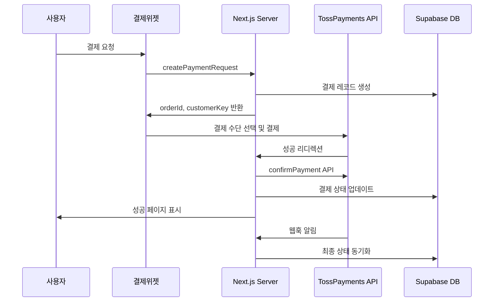

# TossPayments 결제 모듈

Photo4You 프로젝트의 TossPayments 결제 시스템 구현입니다.

## 📁 디렉토리 구조

```
lib/payments/
├── README.md              # 이 파일
├── toss-types.ts          # TossPayments 타입 정의
├── toss-client.ts         # 클라이언트 유틸리티 (SDK 초기화, 포매팅)
└── toss-server.ts         # 서버 유틸리티 (API 호출, 암호화)

lib/actions/
└── toss-payments.ts       # Server Actions (결제 처리 로직)

components/payment/
└── toss-payment-widget.tsx # React 결제 위젯 컴포넌트

app/
├── payment/
│   ├── success/page.tsx   # 결제 성공 페이지
│   ├── fail/page.tsx      # 결제 실패 페이지
│   └── example/page.tsx   # 테스트용 예제 페이지
└── api/webhooks/toss/
    └── route.ts           # 웹훅 처리 엔드포인트
```

## 🚀 빠른 시작

### 1. 환경변수 설정

```bash
# .env.local
NEXT_PUBLIC_TOSS_CLIENT_KEY=test_gck_docs_...
TOSS_SECRET_KEY=test_gsk_docs_...
TOSS_WEBHOOK_SECRET=your_webhook_secret
NEXT_PUBLIC_APP_URL=http://localhost:3000
```

### 2. 기본 사용법

```tsx
import { TossPaymentWidget } from '@/components/payment/toss-payment-widget';

function PaymentPage() {
  const inquiry = {
    id: 'inquiry_123',
    name: '김고객',
    phone: '010-1234-5678',
    email: 'customer@example.com'
  };

  const product = {
    id: 'product_456',
    name: '프리미엄 프로필 촬영',
    price: 150000,
    photographer_id: 'photographer_789'
  };

  const photographer = {
    id: 'photographer_789',
    name: '박작가'
  };

  return (
    <TossPaymentWidget
      inquiry={inquiry}
      product={product}
      photographer={photographer}
      customerKey="unique_customer_key"
      onPaymentComplete={(paymentKey, orderId) => {
        console.log('결제 완료:', { paymentKey, orderId });
      }}
      onPaymentError={(error) => {
        console.error('결제 오류:', error);
      }}
    />
  );
}
```

### 3. Server Actions 사용

```tsx
import { createPaymentRequest, confirmTossPayment } from '@/lib/actions/toss-payments';

// 결제 요청 생성
const formData = new FormData();
formData.append('inquiryId', inquiry.id);
formData.append('amount', product.price.toString());
formData.append('orderName', product.name);

const result = await createPaymentRequest(formData);
if (result.success) {
  const { orderId, customerKey } = result;
  // 결제 위젯에 전달
}
```

## 🔧 주요 기능

### 결제 위젯 (TossPaymentWidget)
- TossPayments SDK v2 기반 결제 위젯
- 카드, 계좌이체, 간편결제 등 모든 결제수단 지원
- 실시간 에러 처리 및 사용자 피드백
- 반응형 디자인 (모바일 최적화)

### Server Actions
- `createPaymentRequest`: 초기 결제 요청 생성
- `confirmTossPayment`: 결제 승인 처리
- `cancelTossPayment`: 결제 취소/환불
- `getTossPaymentStatus`: 결제 상태 조회

### 웹훅 처리
- 결제 완료, 취소, 실패 등 모든 이벤트 처리
- 서명 검증을 통한 보안 강화
- 자동 데이터베이스 상태 동기화

## 💳 지원하는 결제수단

- **신용카드/체크카드**: 모든 국내 카드사
- **계좌이체**: 실시간 계좌이체
- **가상계좌**: 은행별 가상계좌 발급
- **간편결제**: 토스페이, 네이버페이, 카카오페이, 삼성페이 등
- **휴대폰 결제**: 통신사 결제

## 🔐 보안 기능

- **웹훅 서명 검증**: HMAC-SHA256 기반
- **HTTPS 강제**: 모든 결제 통신 암호화
- **PCI DSS 준수**: TossPayments의 보안 인증
- **토큰화**: 민감한 카드 정보 직접 처리 안함

## 📊 데이터 플로우



## 🧪 테스트

### 개발 환경 테스트
1. `/payment/example` 페이지 접속
2. 테스트 결제 정보로 결제 진행
3. 성공/실패 시나리오 확인

### 테스트 카드번호
```
카드번호: 4000-0000-0000-0002
유효기간: 아무값
CVC: 아무값
```

## 🔧 커스터마이징

### 결제 위젯 스타일 변경
```tsx
<TossPaymentWidget
  // ... 기본 props
  className="custom-payment-widget"
  variantKey="CUSTOM" // 위젯 변형
/>
```

### 에러 메시지 커스터마이징
`lib/payments/toss-client.ts`의 `getTossErrorMessage` 함수 수정

### 결제 플로우 확장
`lib/actions/toss-payments.ts`에 새로운 Server Actions 추가

## 📚 참고 문서

- [TossPayments 공식 문서](https://docs.tosspayments.com/)
- [결제위젯 SDK 가이드](https://docs.tosspayments.com/guides/v2/payment-widget/integration)
- [결제 API 참조](https://docs.tosspayments.com/reference)

## 🐛 문제 해결

### 자주 발생하는 오류

1. **"TossPayments 클라이언트 키가 설정되지 않았습니다"**
   - `.env.local`에 `NEXT_PUBLIC_TOSS_CLIENT_KEY` 확인

2. **결제 위젯이 로딩되지 않음**
   - 네트워크 상태 확인
   - 브라우저 개발자 도구 콘솔 오류 확인

3. **웹훅이 동작하지 않음**
   - `TOSS_WEBHOOK_SECRET` 환경변수 확인
   - 웹훅 URL이 HTTPS인지 확인 (ngrok 사용 권장)

## 📞 지원

문의사항이 있으시면 다음 방법으로 연락주세요:
- 개발팀 내부 슬랙 채널
- 이슈 트래커를 통한 버그 리포트
- TossPayments 고객지원: 1588-7654

---

*이 문서는 Photo4You v2 결제 시스템 마이그레이션 과정에서 작성되었습니다.*