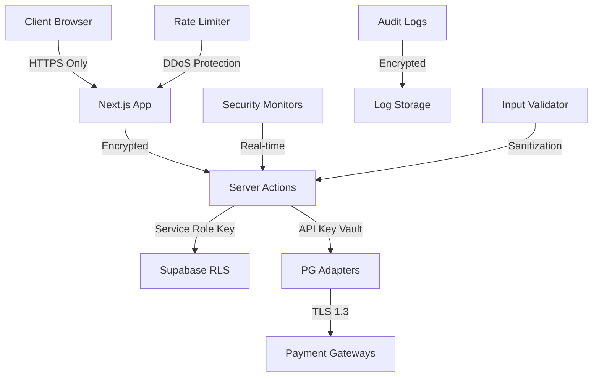

# Iris 멀티 PG 결제 시스템 구현 계획 (수정본)
## 📋 프로젝트 실제 구조 반영 및 보안 강화

이 문서는 Iris 프로젝트의 실제 데이터베이스 구조와 보안 요구사항을 반영한 **수정된 결제 시스템 구현 계획**입니다.

---

## 🎯 1. 현재 시스템 분석

### 1.1 실제 데이터베이스 구조
- **메인 예약 테이블**: `inquiries` (결제 관련 필드 없음)
- **존재하지 않는 테이블**: `payments`, `refunds`, `program_participants`
- **사용자 시스템**: `photographers` (작가), `auth.users` (관리자)
- **성격 진단 시스템**: `quiz_sessions`, `personality_types` 등

### 1.2 현재 예약 플로우
1. 성격 진단 (`quiz_sessions`)
2. 작가 매칭 및 선택
3. 예약 정보 입력 (`inquiries` 테이블에 저장)
4. **결제 기능 없음** ⚠️

### 1.3 주요 수정사항
- 결제 테이블 신규 생성 필요
- `inquiries` 테이블과의 연동 설계
- 보안 우선 아키텍처 설계

---

## 🛡️ 2. 보안 우선 아키텍처

### 2.1 보안 원칙
1. **최소 권한 원칙**: 각 컴포넌트는 최소한의 권한만 보유
2. **심층 방어**: 다중 보안 계층 적용
3. **데이터 보호**: 모든 민감 정보 암호화
4. **감사 추적**: 모든 결제 관련 활동 로깅
5. **실시간 모니터링**: 이상 거래 탐지 및 차단

### 2.2 보안 아키텍처



---

## 🗄️ 3. 데이터베이스 스키마 설계 (실제 프로젝트 반영)

### 3.1 새로 생성할 테이블

#### `payments` 테이블 (PG 중립적)
```sql
CREATE TABLE payments (
    id UUID PRIMARY KEY DEFAULT gen_random_uuid(),
    inquiry_id UUID NOT NULL REFERENCES inquiries(id) ON DELETE CASCADE,
    photographer_id UUID REFERENCES photographers(id),
    order_id VARCHAR(100) NOT NULL UNIQUE,
    
    -- PG 중립적 필드들
    provider VARCHAR(20) NOT NULL DEFAULT 'nicepay', -- 'nicepay', 'eximbay', 'adyen', 'toss'
    provider_transaction_id VARCHAR(64), -- PG별 거래 ID
    raw_response JSONB, -- 원본 PG 응답 데이터
    
    -- 결제 정보
    amount INTEGER NOT NULL CHECK (amount > 0),
    currency VARCHAR(3) DEFAULT 'KRW',
    payment_method VARCHAR(50) NOT NULL, -- 표준 결제수단
    status VARCHAR(20) DEFAULT 'pending', -- 'pending', 'paid', 'failed', 'cancelled', 'refunded'
    
    -- 구매자 정보 (inquiries에서 복사)
    buyer_name VARCHAR(100) NOT NULL,
    buyer_email VARCHAR(255) NOT NULL,
    buyer_phone VARCHAR(20),
    
    -- 보안 필드
    client_ip INET, -- 요청자 IP
    user_agent TEXT, -- 브라우저 정보
    encrypted_data BYTEA, -- 민감 정보 암호화 저장
    
    -- 타임스탬프
    paid_at TIMESTAMP WITH TIME ZONE,
    failed_at TIMESTAMP WITH TIME ZONE,
    cancelled_at TIMESTAMP WITH TIME ZONE,
    expires_at TIMESTAMP WITH TIME ZONE DEFAULT (NOW() + INTERVAL '1 hour'),
    created_at TIMESTAMP WITH TIME ZONE DEFAULT NOW(),
    updated_at TIMESTAMP WITH TIME ZONE DEFAULT NOW(),
    
    -- 하위 호환성 필드들 (deprecated)
    tid VARCHAR(64), -- 나이스페이 전용 (추후 제거 예정)
    auth_token VARCHAR(255), -- 나이스페이 전용
    nicepay_response JSONB -- 나이스페이 응답 (추후 제거 예정)
);

-- 보안 인덱스
CREATE INDEX idx_payments_inquiry_id ON payments(inquiry_id);
CREATE INDEX idx_payments_provider_tid ON payments(provider, provider_transaction_id);
CREATE INDEX idx_payments_status ON payments(status) WHERE status IN ('pending', 'paid');
CREATE INDEX idx_payments_created_at ON payments(created_at);
CREATE INDEX idx_payments_client_ip ON payments(client_ip); -- 이상 거래 탐지용
```

#### `refunds` 테이블 (PG 중립적)
```sql
CREATE TABLE refunds (
    id UUID PRIMARY KEY DEFAULT gen_random_uuid(),
    payment_id UUID NOT NULL REFERENCES payments(id) ON DELETE CASCADE,
    
    -- PG 중립적 필드들
    provider VARCHAR(20) NOT NULL,
    provider_refund_id VARCHAR(64),
    refund_response JSONB,
    
    -- 환불 정보
    refund_amount INTEGER NOT NULL CHECK (refund_amount > 0),
    refund_reason TEXT NOT NULL,
    refund_type VARCHAR(10) NOT NULL DEFAULT 'full', -- 'full', 'partial'
    status VARCHAR(20) DEFAULT 'pending', -- 'pending', 'completed', 'failed'
    
    -- 환불 계좌 정보 (가상계좌 환불시 필요)
    refund_account VARCHAR(50),
    refund_bank_code VARCHAR(10),
    refund_holder VARCHAR(100),
    
    -- 요청자 및 처리자 정보
    requested_by UUID NOT NULL REFERENCES auth.users(id),
    processed_by UUID REFERENCES auth.users(id),
    requested_at TIMESTAMP WITH TIME ZONE DEFAULT NOW(),
    processed_at TIMESTAMP WITH TIME ZONE,
    
    -- 보안 필드
    admin_note TEXT,
    client_ip INET,
    
    created_at TIMESTAMP WITH TIME ZONE DEFAULT NOW(),
    updated_at TIMESTAMP WITH TIME ZONE DEFAULT NOW(),
    
    -- 하위 호환성 (deprecated)
    cancelled_tid VARCHAR(64),
    nicepay_response JSONB
);

CREATE INDEX idx_refunds_payment_id ON refunds(payment_id);
CREATE INDEX idx_refunds_status ON refunds(status);
CREATE INDEX idx_refunds_requested_by ON refunds(requested_by);
```

#### `payment_logs` 테이블 (보안 감사용)
```sql
CREATE TABLE payment_logs (
    id UUID PRIMARY KEY DEFAULT gen_random_uuid(),
    payment_id UUID REFERENCES payments(id) ON DELETE SET NULL,
    provider VARCHAR(20), -- 로그 생성 PG
    
    -- 이벤트 정보
    event_type VARCHAR(50) NOT NULL, -- 'payment_created', 'payment_approved', 'webhook_received' 등
    event_data JSONB,
    
    -- 보안 정보
    ip_address INET,
    user_agent TEXT,
    referer TEXT,
    session_id VARCHAR(255),
    user_id UUID REFERENCES auth.users(id),
    
    -- 성능 메트릭
    response_time_ms INTEGER,
    http_status_code INTEGER,
    
    -- 보안 플래그
    is_suspicious BOOLEAN DEFAULT false,
    risk_score INTEGER DEFAULT 0 CHECK (risk_score BETWEEN 0 AND 100),
    
    error_message TEXT,
    created_at TIMESTAMP WITH TIME ZONE DEFAULT NOW()
);

CREATE INDEX idx_payment_logs_payment_id ON payment_logs(payment_id);
CREATE INDEX idx_payment_logs_event_type ON payment_logs(event_type);
CREATE INDEX idx_payment_logs_created_at ON payment_logs(created_at);
CREATE INDEX idx_payment_logs_suspicious ON payment_logs(is_suspicious) WHERE is_suspicious = true;
CREATE INDEX idx_payment_logs_ip_address ON payment_logs(ip_address);
```

### 3.2 기존 `inquiries` 테이블 확장
```sql
-- 결제 관련 필드 추가
ALTER TABLE inquiries 
ADD COLUMN payment_required BOOLEAN DEFAULT false,
ADD COLUMN payment_amount INTEGER,
ADD COLUMN payment_status VARCHAR(20) DEFAULT 'not_required', -- 'not_required', 'pending', 'paid', 'cancelled'
ADD COLUMN payment_id UUID REFERENCES payments(id),
ADD COLUMN payment_deadline TIMESTAMP WITH TIME ZONE;

-- 인덱스 추가
CREATE INDEX idx_inquiries_payment_status ON inquiries(payment_status) WHERE payment_required = true;
CREATE INDEX idx_inquiries_payment_deadline ON inquiries(payment_deadline) WHERE payment_deadline IS NOT NULL;
```

### 3.3 RLS (Row Level Security) 정책

#### payments 테이블 보안 정책
```sql
-- RLS 활성화
ALTER TABLE payments ENABLE ROW LEVEL SECURITY;

-- 일반 사용자는 자신의 결제만 조회 가능
CREATE POLICY "Users can view own payments" ON payments
FOR SELECT USING (
    inquiry_id IN (
        SELECT id FROM inquiries 
        WHERE phone = current_setting('app.current_user_phone', true)
        OR email = current_setting('app.current_user_email', true)
    )
);

-- 인증된 관리자는 모든 결제 조회 가능
CREATE POLICY "Admins can view all payments" ON payments
FOR SELECT USING (
    EXISTS (
        SELECT 1 FROM auth.users 
        WHERE auth.users.id = auth.uid()
        AND user_metadata->>'user_type' = 'admin'
    )
);

-- 작가는 본인 관련 결제만 조회 가능
CREATE POLICY "Photographers can view own payments" ON payments
FOR SELECT USING (
    photographer_id = auth.uid()
);

-- 결제 생성은 서비스 역할만 가능 (Server Actions에서)
CREATE POLICY "Service role can insert payments" ON payments
FOR INSERT WITH CHECK (
    auth.role() = 'service_role'
);

-- 결제 상태 업데이트는 서비스 역할만 가능
CREATE POLICY "Service role can update payments" ON payments
FOR UPDATE USING (
    auth.role() = 'service_role'
);
```

#### payment_logs 테이블 보안 정책
```sql
ALTER TABLE payment_logs ENABLE ROW LEVEL SECURITY;

-- 로그는 서비스 역할만 삽입 가능
CREATE POLICY "Service role can insert logs" ON payment_logs
FOR INSERT WITH CHECK (auth.role() = 'service_role');

-- 관리자만 로그 조회 가능
CREATE POLICY "Admins can view logs" ON payment_logs
FOR SELECT USING (
    EXISTS (
        SELECT 1 FROM auth.users 
        WHERE auth.users.id = auth.uid()
        AND user_metadata->>'user_type' = 'admin'
    )
);
```

---

## 🔒 4. 보안 강화 계획

### 4.1 인증 및 권한 관리

#### Server Actions 보안
```typescript
'use server'

import { createClient } from '@/lib/supabase/server'
import { headers } from 'next/headers'
import { rateLimit } from '@/lib/security/rate-limit'

export async function createSecurePayment(formData: FormData) {
    // 1. Rate Limiting
    const headersList = headers()
    const ip = headersList.get('x-forwarded-for') || 'unknown'
    
    const rateLimitResult = await rateLimit.check(ip, 'payment_creation')
    if (!rateLimitResult.success) {
        return { error: 'Rate limit exceeded', code: 'RATE_LIMIT' }
    }
    
    // 2. Input Validation & Sanitization
    const validatedData = await validatePaymentRequest(formData)
    if (!validatedData.success) {
        await logSuspiciousActivity(ip, 'invalid_payment_request', validatedData.errors)
        return { error: 'Invalid input', code: 'VALIDATION_ERROR' }
    }
    
    // 3. Service Role Client (최고 권한)
    const supabase = createClient(
        process.env.NEXT_PUBLIC_SUPABASE_URL!,
        process.env.SUPABASE_SERVICE_ROLE_KEY! // 서비스 역할 키 사용
    )
    
    try {
        // 4. 결제 생성 로직...
        const result = await processPaymentCreation(validatedData.data)
        
        // 5. 성공 로그 기록
        await logPaymentEvent(result.paymentId, 'payment_created', {
            ip,
            userAgent: headersList.get('user-agent'),
            amount: validatedData.data.amount
        })
        
        return result
    } catch (error) {
        // 6. 에러 로그 및 알림
        await logPaymentError(error, { ip, formData: validatedData.data })
        await sendSecurityAlert('payment_creation_error', error)
        
        return { error: 'Payment processing failed', code: 'PROCESSING_ERROR' }
    }
}
```

### 4.2 입력 검증 및 정제

#### 강화된 입력 검증
```typescript
// lib/security/validation.ts
import { z } from 'zod'
import DOMPurify from 'dompurify'

const PaymentRequestSchema = z.object({
    inquiryId: z.string().uuid('Invalid inquiry ID format'),
    amount: z.number()
        .int('Amount must be an integer')
        .min(1000, 'Minimum payment amount is 1,000원')
        .max(10000000, 'Maximum payment amount is 10,000,000원'),
    paymentMethod: z.enum(['card', 'bank_transfer', 'wallet:kakaopay', 'wallet:naverpay']),
    buyerName: z.string()
        .min(2, 'Name must be at least 2 characters')
        .max(50, 'Name cannot exceed 50 characters')
        .regex(/^[가-힣a-zA-Z\s]+$/, 'Invalid name format'),
    buyerEmail: z.string().email('Invalid email format'),
    buyerPhone: z.string()
        .regex(/^01[0-9]{8,9}$/, 'Invalid phone number format')
        .transform(phone => phone.replace(/-/g, ''))
})

export async function validatePaymentRequest(formData: FormData) {
    try {
        const rawData = {
            inquiryId: formData.get('inquiryId'),
            amount: Number(formData.get('amount')),
            paymentMethod: formData.get('paymentMethod'),
            buyerName: DOMPurify.sanitize(formData.get('buyerName') as string),
            buyerEmail: DOMPurify.sanitize(formData.get('buyerEmail') as string),
            buyerPhone: DOMPurify.sanitize(formData.get('buyerPhone') as string)
        }
        
        const validatedData = PaymentRequestSchema.parse(rawData)
        
        // 추가 비즈니스 로직 검증
        await validateBusinessRules(validatedData)
        
        return { success: true, data: validatedData }
    } catch (error) {
        return { 
            success: false, 
            errors: error instanceof z.ZodError ? error.errors : [error.message]
        }
    }
}

async function validateBusinessRules(data: any) {
    // 1. Inquiry 존재 여부 및 상태 확인
    // 2. 중복 결제 방지
    // 3. 사용자 권한 확인
    // 4. 결제 가능 시간대 확인
}
```

### 4.3 Rate Limiting 및 DDoS 방어

```typescript
// lib/security/rate-limit.ts
import { Redis } from 'ioredis'

const redis = new Redis(process.env.REDIS_URL!)

interface RateLimitConfig {
    payment_creation: { requests: 3, window: 60 }     // 결제 생성: 1분에 3회
    payment_approval: { requests: 5, window: 300 }    // 결제 승인: 5분에 5회
    refund_request: { requests: 2, window: 3600 }     // 환불 요청: 1시간에 2회
    admin_actions: { requests: 100, window: 60 }      // 관리자: 1분에 100회
}

export class RateLimit {
    async check(identifier: string, action: keyof RateLimitConfig): Promise<{
        success: boolean
        remaining: number
        resetTime: number
    }> {
        const config = RateLimitConfig[action]
        const key = `rate_limit:${action}:${identifier}`
        
        const current = await redis.incr(key)
        
        if (current === 1) {
            await redis.expire(key, config.window)
        }
        
        const remaining = Math.max(0, config.requests - current)
        const ttl = await redis.ttl(key)
        
        if (current > config.requests) {
            // 의심스러운 활동 로깅
            await this.logSuspiciousActivity(identifier, action, current)
            
            return {
                success: false,
                remaining: 0,
                resetTime: Date.now() + (ttl * 1000)
            }
        }
        
        return {
            success: true,
            remaining,
            resetTime: Date.now() + (ttl * 1000)
        }
    }
    
    private async logSuspiciousActivity(identifier: string, action: string, attempts: number) {
        // 보안 로그 기록
        console.warn(`Rate limit exceeded: ${identifier} attempted ${action} ${attempts} times`)
        
        // 심각한 경우 자동 차단
        if (attempts > RateLimitConfig[action].requests * 3) {
            await this.blockIP(identifier)
        }
    }
    
    private async blockIP(ip: string) {
        await redis.setex(`blocked_ip:${ip}`, 3600, 'auto_blocked') // 1시간 차단
        // 관리자에게 알림 전송
        await sendSecurityAlert('ip_auto_blocked', { ip, timestamp: new Date() })
    }
}
```

### 4.4 데이터 암호화 및 보호

```typescript
// lib/security/encryption.ts
import crypto from 'crypto'

const ALGORITHM = 'aes-256-gcm'
const SECRET_KEY = crypto.scryptSync(process.env.ENCRYPTION_KEY!, 'salt', 32)

export class PaymentDataEncryption {
    static encrypt(data: any): { encrypted: string, iv: string, tag: string } {
        const iv = crypto.randomBytes(16)
        const cipher = crypto.createCipher(ALGORITHM, SECRET_KEY, { iv })
        
        const jsonData = JSON.stringify(data)
        let encrypted = cipher.update(jsonData, 'utf8', 'hex')
        encrypted += cipher.final('hex')
        
        const tag = cipher.getAuthTag()
        
        return {
            encrypted,
            iv: iv.toString('hex'),
            tag: tag.toString('hex')
        }
    }
    
    static decrypt(encrypted: string, iv: string, tag: string): any {
        const decipher = crypto.createDecipher(ALGORITHM, SECRET_KEY, {
            iv: Buffer.from(iv, 'hex'),
            authTag: Buffer.from(tag, 'hex')
        })
        
        let decrypted = decipher.update(encrypted, 'hex', 'utf8')
        decrypted += decipher.final('utf8')
        
        return JSON.parse(decrypted)
    }
}

// 민감 정보 저장시 사용
export async function storeSecurePayment(paymentData: any) {
    const sensitiveData = {
        cardInfo: paymentData.cardInfo,
        bankInfo: paymentData.bankInfo,
        personalData: paymentData.personalData
    }
    
    const encrypted = PaymentDataEncryption.encrypt(sensitiveData)
    
    // 암호화된 데이터만 DB에 저장
    return {
        ...paymentData,
        encrypted_data: Buffer.from(JSON.stringify(encrypted)),
        // 민감 정보는 제거
        cardInfo: undefined,
        bankInfo: undefined,
        personalData: undefined
    }
}
```

### 4.5 실시간 보안 모니터링

```typescript
// lib/security/monitoring.ts

interface SecurityAlert {
    type: 'payment_fraud' | 'rate_limit_exceed' | 'suspicious_transaction' | 'api_error'
    severity: 'low' | 'medium' | 'high' | 'critical'
    data: any
    timestamp: Date
}

export class SecurityMonitor {
    static async analyzeTransaction(payment: PaymentData): Promise<{
        riskScore: number
        flags: string[]
        shouldBlock: boolean
    }> {
        let riskScore = 0
        const flags: string[] = []
        
        // 1. 금액 패턴 분석
        if (payment.amount > 1000000) {
            riskScore += 30
            flags.push('large_amount')
        }
        
        // 2. IP 지역 분석
        const ipLocation = await getIPLocation(payment.clientIp)
        if (ipLocation.country !== 'KR') {
            riskScore += 50
            flags.push('foreign_ip')
        }
        
        // 3. 시간대 분석 (새벽 시간대 결제는 위험도 증가)
        const hour = new Date().getHours()
        if (hour >= 2 && hour <= 6) {
            riskScore += 20
            flags.push('unusual_time')
        }
        
        // 4. 반복 결제 패턴 확인
        const recentPayments = await getRecentPaymentsByIP(payment.clientIp)
        if (recentPayments.length > 3) {
            riskScore += 40
            flags.push('frequent_payments')
        }
        
        // 5. 이메일/전화번호 검증
        const isValidUser = await validateUserCredentials(payment.buyerEmail, payment.buyerPhone)
        if (!isValidUser) {
            riskScore += 60
            flags.push('invalid_credentials')
        }
        
        // 위험도에 따른 처리 결정
        const shouldBlock = riskScore >= 80
        
        // 고위험 거래 알림
        if (riskScore >= 70) {
            await this.sendAlert({
                type: 'suspicious_transaction',
                severity: shouldBlock ? 'critical' : 'high',
                data: { payment, riskScore, flags },
                timestamp: new Date()
            })
        }
        
        return { riskScore, flags, shouldBlock }
    }
    
    static async sendAlert(alert: SecurityAlert) {
        // 1. 관리자 이메일/SMS 발송
        // 2. Slack/Discord 웹훅 전송
        // 3. 보안 로그에 기록
        // 4. 심각한 경우 자동 차단
        
        await Promise.all([
            sendEmailAlert(alert),
            sendSlackAlert(alert),
            logSecurityEvent(alert)
        ])
    }
}
```

### 4.6 PCI DSS 준수 계획

```typescript
// lib/security/pci-compliance.ts

export class PCICompliance {
    // 1. 카드 정보는 절대 저장하지 않음
    static validateNoCardStorage(paymentData: any) {
        const forbiddenFields = ['cardNumber', 'cvv', 'expiryDate', 'pin']
        
        for (const field of forbiddenFields) {
            if (paymentData[field]) {
                throw new Error(`PCI Violation: ${field} must not be stored`)
            }
        }
    }
    
    // 2. 로그에서 민감 정보 제거
    static sanitizeLogData(data: any): any {
        const sanitized = { ...data }
        
        // 카드번호 마스킹 (****-****-****-1234)
        if (sanitized.cardNumber) {
            sanitized.cardNumber = this.maskCardNumber(sanitized.cardNumber)
        }
        
        // 기타 민감 정보 제거
        delete sanitized.cvv
        delete sanitized.pin
        delete sanitized.authToken
        
        return sanitized
    }
    
    private static maskCardNumber(cardNumber: string): string {
        if (cardNumber.length < 4) return '****'
        return '*'.repeat(cardNumber.length - 4) + cardNumber.slice(-4)
    }
}
```

---

## 🚀 5. 구현 단계별 계획 (보안 우선)

### Phase 1: 보안 인프라 구축 (1주)
1. **Database Migration**
   - `payments`, `refunds`, `payment_logs` 테이블 생성
   - RLS 정책 설정
   - 암호화 키 관리 시스템 구축

2. **보안 라이브러리 구현**
   - Rate Limiting 시스템
   - 입력 검증 및 정제
   - 데이터 암호화
   - 보안 모니터링

### Phase 2: 기본 결제 시스템 (1주)
1. **NicePay Adapter 구현**
   - 보안 강화된 Server Actions
   - 웹훅 처리 (서명 검증 포함)
   - 이상 거래 탐지 및 차단

2. **Inquiries 연동**
   - 기존 예약 시스템과 결제 연동
   - 결제 상태별 플로우 처리

### Phase 3: 다중 PG 지원 (2주)
1. **PaymentAdapter Factory**
   - PG별 어댑터 구현
   - 동적 라우팅 및 실패 시 대체 PG 처리

2. **해외 결제 시스템**
   - Eximbay/Adyen 어댑터 구현
   - 다국가/다통화 지원

### Phase 4: 보안 강화 및 모니터링 (1주)
1. **실시간 모니터링**
   - 이상 거래 탐지 AI 모델 적용
   - 자동 차단 및 알림 시스템

2. **컴플라이언스**
   - PCI DSS 감사 준비
   - GDPR 개인정보 보호 강화

---

## 🔍 6. 보안 테스트 계획

### 6.1 침투 테스트
- **SQL Injection** 방어 테스트
- **XSS/CSRF** 방어 테스트
- **Rate Limiting** 우회 시도
- **결제 데이터 조작** 시도

### 6.2 부하 테스트
- 동시 결제 요청 1000건 테스트
- DDoS 공격 시뮬레이션
- DB 연결 풀 고갈 테스트

### 6.3 보안 감사
- 코드 정적 분석 (SonarQube)
- 종속성 취약점 검사 (npm audit)
- 암호화 강도 검증

---

## ⚠️ 7. 위험 관리 및 대응 계획

### 7.1 위험 요소
1. **결제 데이터 유출**: 암호화 + RLS + 접근 로깅
2. **서비스 중단**: 다중 PG + 자동 실패 복구
3. **사기 거래**: AI 기반 실시간 탐지
4. **API 키 노출**: Key Rotation + Vault 사용
5. **DDoS 공격**: Rate Limiting + CDN 방어

### 7.2 사고 대응 절차
1. **탐지**: 자동 모니터링 시스템
2. **격리**: 자동 차단 + 수동 검토
3. **복구**: 백업 시스템 가동
4. **사후 분석**: 로그 분석 + 개선 방안 도출

---

## 📊 8. 성공 지표 (KPI)

### 8.1 보안 지표
- **보안 사고 발생률**: 0건/월
- **이상 거래 탐지율**: 95% 이상
- **평균 응답 시간**: 2초 이내
- **가용률**: 99.9% 이상

### 8.2 비즈니스 지표
- **결제 성공률**: 95% 이상
- **사용자 이탈률**: 5% 이하
- **고객 만족도**: 4.5/5 이상

---

## 🎯 결론

이 수정된 계획은 Iris 프로젝트의 실제 데이터베이스 구조를 반영하고, **보안을 최우선**으로 하는 결제 시스템을 구축합니다. 

### 핵심 개선사항
1. ✅ **실제 DB 구조 반영**: `inquiries` 테이블 중심 설계
2. ✅ **보안 강화**: 다중 보안 계층, 실시간 모니터링, PCI DSS 준수  
3. ✅ **PG 중립화**: 향후 해외 진출을 위한 확장성 확보
4. ✅ **Server Actions**: Next.js 네이티브 방식으로 성능 및 보안 향상
5. ✅ **감사 추적**: 모든 결제 활동의 완전한 로깅 및 추적

이 계획을 통해 Iris는 **안전하고 확장 가능한 글로벌 결제 시스템**을 구축할 수 있습니다.